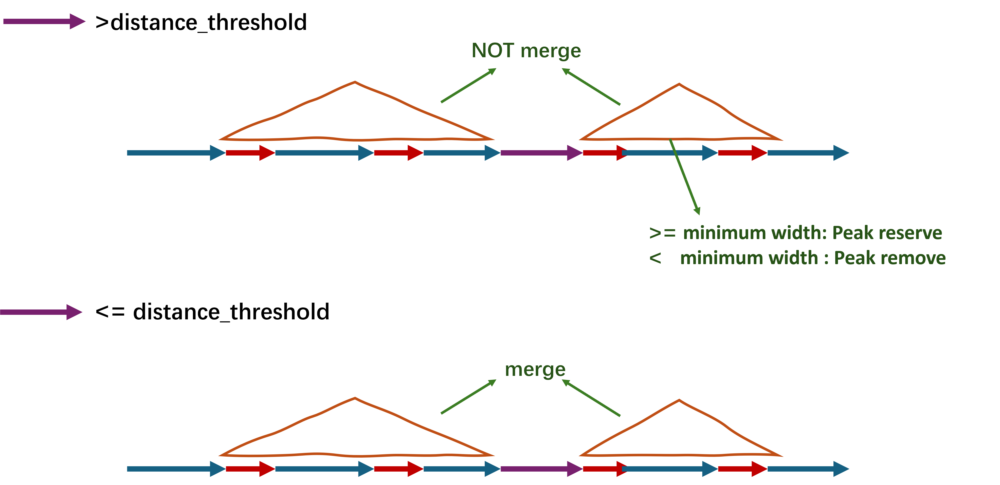

# Preface

Analysis_of_peak_downstream are consist of three parts

-   Genome Coordinate Conversion,

-   Peak overlap

-   peak Annotation, Comparison and Visualization

------------------------------------------------------------------------

## Genome Coordinate Conversion

When conducting research, we need to unify the genome coordinate system. The process of converting from one version of the coordinate system to another is called **liftover(UCSC)** or **crossmap (Ensembl)**.

-   The **UCSC and Ensembl** provides a ready-to-use **web version**:

    [**UCSC** web version](https://genome.ucsc.edu/cgi-bin/hgLiftOver){.uri}

    [**Ensembl** web version](https://grch37.ensembl.org/Homo_sapiens/Tools/AssemblyConverter){.uri} **(Only support species: human, mouse, Caenorhabditis elegans, Saccharomyces cerevisiae, Zebrafish)**

------------------------------------------------------------------------

## Peak overlap

This part about how to find overlaps of peaks?

-   First, we use the peak files to create **`GRanges`** objects.

-   **`findOverlaps()`** : Creating **`NCList`** and **`GNCList`** objects to find the overlaps between two "range-based" objects.

-   **`findOverlapsOfPeaks()`** :Ising **`findOverlaps()`** another version for peaks.

-   **`makeVennDiagram()`** : Making Venn Diagram for peaks.

------------------------------------------------------------------------

## **peak Annotation, Comparison and Visualization**

This part about [**`ChIPseeker`**](https://bioconductor.org/packages/release/bioc/vignettes/ChIPseeker/inst/doc/ChIPseeker.html) usage, an R package for **peak Annotation, Comparison and Visualization**

-   If two ChIP seq data, obtained by two different binding proteins, overlap significantly, these two proteins may form a complex or have interaction in regulation chromosome remodelling or gene expression. 

-   [**`ChIPseeker`**](https://bioconductor.org/packages/release/bioc/vignettes/ChIPseeker/inst/doc/ChIPseeker.html) support statistical testing of significant overlap among ChIP seq data sets, and incorporate open access database GEO (contains **17,000 bed file**) for users to compare their own dataset to those deposited in database

-   Converting genome coordinations from one genome version to another is also supported

------------------------------------------------------------------------

# Basic knowledge

## 0-base or 1-base？

-   [详见](https://genome-blog.gi.ucsc.edu/blog/2016/12/12/the-ucsc-genome-browser-coordinate-counting-systems/)

-   在**0-based**坐标系中，起始位置从 0 开始计数，范围是 **[start, end)** ，即 **end 位置不包含在区间内**。

-   在**1-based**坐标系中，起始位置从 1 开始计数，范围是 **[start, end]** ，即 **end 位置包含在区间内**。

| 文件格式 | 坐标系统 | 说明 |
|----|----|----|
| **BED (UCSC)** | **0-based** | `[start, end)` |
| **GTF/GFF (Ensembl)** | **1-based** | `[start, end]` |
| **VCF (Ensembl)** | **1-based** | 变异位点坐标从 1 开始，不是区间，而是单个碱基的位置 |
| **BAM/SAM** | **1-based** | 比对起始位置为 1-based，CIGAR 操作的结果确定终止位置 |
| **LiftOver** | **0-based** | 输入文件通常是 0-based（如 BED） |
| **CrossMap** | **根据输入格式** | 支持多种格式，如 BED（0-based）、GTF/GFF/VCF（1-based） |

------------------------------------------------------------------------

## GRCh38 vs hg38 or mRatBN7.2 vs rn7?

### **GRCh38 vs hg38**

-   **GRCh38:** The Human Reference Genome maintained by the Genome Reference Consortium (GRC) is the 38th edition of the Genome Reference Consortium Human series.

-   **hg38:** indicates the GRCh38 version used by UCSC

-   **Same**

    GRCh38 and hg38 share the **same genome sequence**, so **most of the coordinates are identical**

-   **Different**

    **UCSC** uses the **UCSC-specific mitochondrial genome (chrM)** in **hg38**, while **GRCh38** may use a **different mitochondrial version** (such as **rCRS or GRCh38_MT**).

    **UCSC** has added **alternate haplotypes** in **hg38**

------------------------------------------------------------------------

### **What is the Haplotype Patches or alternate haplotypes ?**

-   **单倍型补丁（Haplotype Patches）**

    ``` text
    chr1    1000000 1000500 region_A    100 +
    chr1    2000000 2000600 region_B    200 -
    chr1_KI270706v1_random  50000   50500   patch_region    150 +
    ```

    -   **chr1_KI270706v1_random** 是 单倍型补丁，用于修复 chr1 上某个复杂区域的问题。

    -   这些补丁的坐标通常是独立的，它们不会直接与主染色体坐标系对应（即 chr1 和 chr1_KI270706v1_random 可能是相互独立的）

-   **替代单倍型（Alternate Haplotypes）**

    ``` text
    chr6    3000000 3000500 MHC_region_ref  500 +
    chr6_GL000256v2_alt 3000000 3000500 MHC_region_alt  500 +
    ```

    -   **chr6** 是标准染色体的 MHC （Major Histocompatibility Complex，主要组织相容性复合体）(负责编码细胞表面的分子，用于抗原呈递和免疫系统识别)（主参考序列）。

    -   **chr6_GL000256v2_alt** 是 MHC 替代单倍型（alt haplotype），用于提供该区域的另一种版本，表示在不同人群中可能存在的变异。

------------------------------------------------------------------------

### **mRatBN7.2 vs rn7**

It's the same version of the genome, just from a different database

-   **mRatBN7.2** from Ensemble

-   **rn7** from UCSC

------------------------------------------------------------------------

### **Conclusion**

| **特性** | **mRatBN7.2** | **rn7** | **GRCh38** | **hg18** |
|----|----|----|----|----|
| **数据来源** | Wellcome Sanger Institute / Ensembl | UCSC Genome Browser | Genome Reference Consortium (GRC) | UCSC Genome Browser |
| **发布机构** | Ensembl | UCSC | GRC / Ensembl | UCSC |
| **染色体命名** | 1, 2, X, Y, MT | chr1, chr2, chrX, chrY, chrM | 1, 2, X, Y, MT | chr1, chr2, chrX, chrY, chrM |
| **坐标系统** | 1-based | 1-based | 1-based | 1-based |
| **单倍型补丁 (Alternate Haplotypes)** | 有（Ensembl 也使用） | UCSC 可能有不同的命名方式 | 有（与 Ensembl 一致） | 无 |

------------------------------------------------------------------------

## `GRanges` and `IRanges` objects

The central feature of **GenomicRanges** is the **`GRanges`** and **`IRanges`(IntegerRanges)** object, which represents genomic intervals.

------------------------------------------------------------------------

### **`GRanges` objects**

-   Each **`GRanges`** object can include the following

    -   components:Chromosome Names (**`seqnames`**)

    -   **`Start`** and **`End`** Positions (**`ranges`**)

    -   **`Strand`** Information

        -   Positive strand: **`+`**

        -   Negative strand: **`-`**

        -   Unspecified strand: **`*`**

    -   Additional Metadata(**`score`, `Annotations`[,]{.underline}`Other custom attributes`**)

```{r}
# loading package
# processing genomic data.
library(rtracklayer)

# crea two GRanges object
query <- GRanges(seqnames = c("chr1","chr1","chr1"),
                  ranges = IRanges(start = c(100, 300, 500), 
                                   end = c(200, 400, 600),
                                   names=c("a","b","c")),
                  score = c(10, 20, 30),
                  strand="+")

subject <- GRanges(seqnames = c("chr1", "chr1", "chr2"),
                  ranges = IRanges(start = c(150, 175, 550), 
                                   end = c(250, 450, 650),
                                   names=c("A","B","C")),
                  score = c(20, 40, 20),
                  strand="+")
```

```{r}
# check the GRanges object
query
subject
```

-   You can use **bed file** as input to creat **`GRanges`** objects

    ```{r eval=FALSE, include=FALSE}
    peak1 <- toGRanges("peak1.bed", format="BED")
    peak2 <- toGRanges("peak2.bed", format="BED")
    ```

------------------------------------------------------------------------

### **IRanges objects**

-   **`IRanges`(IntegerRanges)** **lack** the informations of **`seqnames`** and **`strand`** and add the width informations compareing to **`GRanges`**

    ```{r}
    # 创建 IRanges 对象
    ir <- IRanges(start = c(1, 3, 20), end = c(13, 7, 25))

    # 查看对象
    ir
    ```

------------------------------------------------------------------------

## NCList and GNCList objects

-   如果query中有$Q$个区间，subject中有$S$个区间，传统方法需要进行$Q×S$次比较。

-   **`NCList`** 通过分区和排序，嵌套分组，这样，每次搜索时只需要在相关层次中寻找，而不需要扫描所有区间

    

-   **`GNCList`**是**`NCList`**的扩展版本，专门用于处理带有基因组序列名称（**seqnames**）的范围对象。

    | 特性 | `NCList` | `GNCList` |
    |----|----|----|
    | **适用范围** | 无染色体信息，仅处理一般范围 | 适用于带有染色体（`seqnames`）信息的基因组范围 |
    | **分组** | 无需分组，仅使用嵌套结构 | 按染色体分组，每个组内使用 NCList |
    | **性能** | 适用于小型范围数据 | 针对大型基因组数据优化，避免跨染色体比较 |

-   **`findOverlaps()`** 和 **`countOverlaps()`**会自动对 subject 创建 **`NCList`**和**`GNCList`**，以优化重叠计算的效率。用户通常无需手动构建 **`NCList`**和**`GNCList`**。

```{r}
# creat nclist and gnclist

# 当你处理像环状染色体（如线粒体 DNA）数据时
# circle.length定义了“环长
# 当区间超出边界时，使用 circle.length 可以让区间“回到起点”，模拟环状数据
nclist <- NCList(ir,
                 #circle.length=NA_integer_
                   )

gnclist <- GNCList(subject)

nclist
gnclist
```

------------------------------------------------------------------------

## `TxDb` and `EnsDb`

### **`TxDb` object**

-   **`TxDb`** (Transcript Database) is a object provided by Bioconductor for storing annotation information of genomes

-   you can download from Bioconductor

    ```{r}
    # loading packages
    library(AnnotationHub)

    # downland AnnotationHub database
    AH <- AnnotationHub()

    # Query all available Txdb databases
    query(AH , "Txdb.Rnorvegicus.UCSC.rn6")
    ```

    ```{r}
    # According to AH ID to downland database
    # A larger AH ID indicates a newer version.
    TxDb <- AH[["AH70598"]]
    ```

-   you can use **`GFF/GTF`** to build **`TxDb`** object

    

    ```{r eval=FALSE, include=FALSE}
    # loading packages
    library(GenomicFeatures)

    # makeTxDb
    TxDb <- makeTxDbFromGFF("./Rattus_norvegicus.mRatBN7.2.113.gtf")
    ```

------------------------------------------------------------------------

### **`EnsDb`**

-   我们还可以使用 **Ensembl-based `EnsDb`** 注释数据库（由 [`ensembldb`](http://127.0.0.1:28103/session/Rvig.861c7c7c45e9.html) 包提供）作为**`TxDb`** objects 进行输入

-   但需要用**`seqlevelsStyle()`** 对染色体名称进行转换

    | 特性 | **`EnsDb`** | **`TxDb`** |
    |----|----|----|
    | **数据来源** | Ensembl数据库的基因组注释数据 | 多种注释源（如UCSC、NCBI） |
    | **数据内容** | 基因、转录本、外显子、CDS等全面信息 | 主要包含转录本信息，如外显子、内含子 |
    | **适用场景** | 基因组级别的分析，特别是Ensembl注释 | 转录本分析，关注转录本结构与功能 |

    ```{r eval=FALSE, include=FALSE}
    # loading packages
    library(ensembldb)

    # downland AnnotationHub database
    AH <- AnnotationHub()

    # Query all available Txdb databases
    # This 113 is the version number for the EnsDb database
    query(AH, "113 EnsDb for Rattus norvegicus")

    # According to AH ID to downland database
    edb <- AH[["AH119437"]]

    # Change the chromosome names to UCSC style
    seqlevelsStyle(edb) <- "UCSC" 
    ```

------------------------------------------------------------------------

## `GFF(GFF3)`/`GTF(GTF2)`

[**基因组注释文件(GFF,GTF)下载的五种方法**](https://blog.csdn.net/u011262253/article/details/89363809)

------------------------------------------------------------------------

### **`GFF(GFF3)`**

-   **`GFF`**(General Feature Format)是一种用来描述基因组特征的文件

-   现在我们所使用的大部分都是第三版（[**`GFF3`**](https://gmod.org/wiki/GFF3)）

    ``` text
    ctg123 . mRNA            1300  9000  .  +  .  ID=mrna0001;Name=sonichedgehog
    ctg123 . exon            1300  1500  .  +  .  ID=exon00001;Parent=mrna0001
    ctg123 . exon            1050  1500  .  +  .  ID=exon00002;Parent=mrna0001
    ctg123 . exon            3000  3902  .  +  .  ID=exon00003;Parent=mrna0001
    ctg123 . exon            5000  5500  .  +  .  ID=exon00004;Parent=mrna0001
    ctg123 . exon            7000  9000  .  +  .  ID=exon00005;Parent=mrna0001
    ```

    | 列名 | 描述 |
    |----|----|
    | seqid | 参考序列的 ID |
    | source | 该特征的来源，未知时用 `.` 代替 |
    | type | 特征类型，如 `gene`、`exon`、`CDS` 等，建议使用 SO 术语 |
    | start | 起始坐标（1-based） |
    | end | 终止坐标 |
    | score | 量化得分，空值用 `.` 代替 |
    | strand | `+` 表示正链，`-` 表示负链，`.` 表示无方向要求 |
    | phase | CDS 需要此列，当前 CDS 片段的起始碱基在密码子中的偏移量。它的值可以是 0、1 或 2 |
    | attributes | 属性列表，格式为 `key=value`，不同属性用 `;` 分隔 |

------------------------------------------------------------------------

### `GTF (GTF2)`

-   **`GTF`**(gene transfer format)，主要是用来对基因进行注释

-   当前所广泛使用的GTF格式为第二版（**`GTF2`**）

    ``` text
    AB000381 Twinscan  CDS          700   707   .   +   2  gene_id "AB000381.000"; transcript_id "AB000381.000.1";
    AB000381 Twinscan  exon         900  1000   .   +   .  gene_id "AB000381.000"; transcript_id "AB000381.000.1";
    AB000381 Twinscan  start_codon  380   382   .   +   0  gene_id "AB000381.000"; transcript_id "AB000381.000.1";
    AB000381 Twinscan  stop_codon   708   710   .   +   0  gene_id "AB000381.000"; transcript_id "AB000381.000.1";
    ```

    | 列名 | 描述 |
    |----|----|
    | seqname | 序列 ID，通常是染色体 ID 或 Contig ID |
    | source | 该特征的来源，未知时用 `.` 代替 |
    | type | 特征类型，特征类型，如 `CDS`、`start_codon`(起始密码子)、`stop_codon`（终止密码子） （**这一列必须注明**） |
    | start | 起始坐标（1-based） |
    | end | 终止坐标 |
    | score | 量化得分，空值用 `.` 代替 |
    | strand | `+` 表示正链，`-` 表示负链，`.` 表示无方向要求 |
    | frame | 读码框（0、1 或 2，仅适用于 `CDS`） |
    | attributes | 其他信息（键值对，`key "value";` 格式） |

------------------------------------------------------------------------

### **Different from `GFF` of `GTF`**

| 对比项 | **`GFF3`** | **`GTF2`** |
|----|----|----|
| type/feature | 必须注明 | 可以是任意名称 |
| attributes | `key=value` | `key "value"` |
| attributes 层级 | 明确层级关系（gene → mRNA → exon/CDS） | 层级关系相对不严格 |
| 支持的特征 | 更丰富（gene, mRNA, exon, CDS, ncRNA, repeat_region 等） | 主要针对转录组数据（gene, transcript, exon, CDS） |

------------------------------------------------------------------------

# Genome Coordinate Conversion

## Loading package

```{r message=FALSE, warning=FALSE}
# Delete all objects
rm(list = ls())

# Loading package
library(R.utils)      # enhance the basic functions of R.
library(rtracklayer)  # processing genomic data.
library(dplyr)        # Data Processing and Operations
```

------------------------------------------------------------------------

## Processing data

Processing bed file as **`GRanges`** (**`GRanges`** objects as input in **`liftOver()`**

-   you can import bed file as dataframe to create **`GRanges`** object**(Recommend)**。

-   You should modify the chromosome names to conform to the genome format (e.g., **1** should become **chr1**)

    **UCSC** use **chr1** and **chrM** and version

    ```{r}
    # import bed file as dataframe
    bed_data <- read.csv(file = "./Demo0625.csv")

    # remove duplicate
    bed_data <- bed_data %>% distinct(bed_data$name,.keep_all = TRUE)


    # create GRanges objects
    query <- GRanges(seqnames = bed_data$chr,
                      ranges = IRanges(start = bed_data$start, 
                                       end = bed_data$end,
                                       names=bed_data$name),
                      score = bed_data$fold_enrichment,
                      strand="*")

    # 修改染色体名称
    seqlevelsStyle(query) <- "UCSC" 


    query
    ```

-   you can use **`import()`** function to directly import bed file as GRange object**(NOT recommend)**。

    ```{r eval=FALSE}
    query <- import("./Demodata.bed")
    ```

------------------------------------------------------------------------

## `Chain file`

**`Chain file`** is a file format used to represent **sequence alignments between different genome assemblies** of the same species or between different species.

------------------------------------------------------------------------

### **Loading chain file**

-   [**UCSC** chain file download web](https://hgdownload.soe.ucsc.edu/downloads.html) **(Recommend)**

    **(choose species ------choose genome version-----choose LifeOver files)**

-   [**Ensembl** chain file download web](https://sourceforge.net/projects/crossmap/files/Ensembl_chain_files/) **(Only have human and mouse)**

```{r}
# decompressing chain file
if (file.exists("rn6ToRn7.over.chain")) {
  print("文件解压成功！")
} else {
  gunzip("rn6ToRn7.over.chain.gz")
  print("文件重新解压完成。")
}


# read chain file
chain_file <- import.chain("rn6ToRn7.over.chain")
```

------------------------------------------------------------------------

## Structure of `chain file`

[Reference](https://genome.ucsc.edu/goldenpath/help/chain.html)

A **`chain file`** is generated by **alignment** two genomes

**`chain file`**里面包含许多块**chain(同源的地方)**

-   each **chain** represents an alignment between two genomic regions

-   其中每块**chain** 由**Header Line** 和 **Alignment Data Lines**组成

-   第一行**`Header Line`**记录**chain**在两个版本中坐标，

-   后面许多行**`alignment data line`**记录具体比对情况。

``` text
chain 4900 chrY 58368225 + 25985403 25985638 chr5 151006098 - 43257292 43257528 1
9 1 0
10 0 5
61 4 0
16 0 4
42 3 0
16 0 8
14 1 0
3 7 0
48

chain 4900 chrY 58368225 + 25985406 25985566 chr5 151006098 - 43549808 43549970 2
16 0 2
60 4 0
10 0 4
```

------------------------------------------------------------------------

### **`Header Line`**

``` text
chain score tName tSize tStrand tStart tEnd qName qSize qStrand qStart qEnd id 
```

-   **`score`** -- chain score （How well the two sequences allign）

-   **`tName`** -- chromosome (reference/target sequence)

-   **`tSize`** -- chromosome size (reference/target sequence)

-   **`tStrand`** -- strand (reference/target sequence)

-   **`tStart`** -- alignment start position (reference/target sequence)

-   **`tEnd`** -- alignment end position (reference/target sequence)

-   **`qName`** -- chromosome (query sequence)

-   **`qSize`** -- chromosome size (query sequence)

-   **`qStrand`** -- strand (query sequence)

-   **`qStart`** -- alignment start position (query sequence)

-   **`qEnd`** -- alignment end position (query sequence)

-   **`id`** -- chain ID

------------------------------------------------------------------------

### **`Alignment Data Lines`**

``` text
size dt dq 
```

-   Alignment Data Lines 将 chain分成许多个 **block**(一致的区域)(对齐块)，每一行代表一个**block**

-   **`size`** -- the size of the ungapped alignment **(block)**

-   **`dt`** -- the difference between the end of this **block** and the beginning of the next **block** **(reference/target sequence)**

-   **`dq`** -- the difference between the end of this **block** and the beginning of the next **block** **(query sequence)**

``` text
     chain 4900 chrY 58368225 + 25985406 25985566 chr5 151006098 - 43549808 43549970 2
     16      0       2
     60      4       0
     10      0       4
     70 
```


------------------------------------------------------------------------

## Genome Coordinate Conversion

We can use function of **`liftOver()`** to transformGenome Coordinate Conversion in R

```{r}
subject <- liftOver(query, chain_file)
```

```{r}
# convert to dataframe
 subject_data <- as.data.frame(subject)
```

------------------------------------------------------------------------

## Merge separate peaks

-   Filter and merge peaks by setting **`distance_threshold`** and **`minimum_width`**

-   这个**`distance_threshold`**与**`minimum_width`**值需要自己把握，需要根据实际情况进行判断

-   这个方法是我一时半了想出来，如果有好的想法可以进行添加与修改。

{width="586"}

{width="568" height="320"}

{width="548"}

------------------------------------------------------------------------

### **Per setting**

```{r}
# setting distance_threshold (base)
distance_threshold <- 30

# setting minimum width of peaks (base)
minimum_width <- 30
```

------------------------------------------------------------------------

### **Function of merge peaks by group**

```{r}
merge_peaks_by_group <- function(df, distance_threshold) {
  df %>%
    group_by(group) %>%  # 按 group 分组
    filter(n_distinct(seqnames) == 1) %>%  # 只保留同一组内染色体相同的行
    arrange(group, start) %>%  # 按照 start 位置排序
    mutate(
      dist_to_prev = start - lag(end, default = first(end))  # 增加dist_to_prev这列，其为当前 start 和前一个 peak 的 end 之间的距离
    ) %>%
    ungroup() %>%  # 取消分组，以便下一步操作
    mutate(
      merge_group = cumsum(dist_to_prev > distance_threshold | is.na(dist_to_prev))  # 增加merge_group列，如果距离大于阈值，增加1（不合并）
    ) %>%
    group_by(group, merge_group) %>%  # 按照 group 和新的merge_group进行分组
    summarise(
      group_name = first(group_name),  # 保留第一个 group_name
      seqnames = first(seqnames),
      start = min(start),  # 取最小的 start
      end = max(end),  # 取最大的 end
      width = end - start,  # 计算新的 width
      strand = first(strand),  # 保留第一个 strand
      score = first(score),  # 保留第一个 score
      .groups = "drop"  # 去掉分组结构
    )
}

```

```{r}
merge_peaks_subject <- merge_peaks_by_group(subject_data,distance_threshold)
```

------------------------------------------------------------------------

### **Remove narrow width of peaks**

-   Evaluate the change in width after liftOver to assess the quality of merged peaks

-   peak whose width **increases too much** after lifover is **removed**

```{r}
# Extract original width
before_width <- bed_data[,c(22,4)]
colnames(before_width) <- c("group_name","before_width")


# merge original width 
merge_peaks_subject <- merge(merge_peaks_subject,before_width,by.x="group_name",by.y="group_name")


# calculate the change in width after liftOver to assess the quality
merge_peaks_subject$width_change <- merge_peaks_subject$width/merge_peaks_subject$before_width*100


# remove narrow width of peaks
merge_peaks_subject <- filter(merge_peaks_subject,merge_peaks_subject$width>=minimum_width)
```

# Peak overlap

## Loading package

```{r message=FALSE, warning=FALSE}
# Delete all objects
rm(list = ls())

# Loading package
library(GenomicRanges)
library(ChIPpeakAnno)
```

-   **GenomicRanges**是R语言中一个强大而灵活的生物信息学包，主要用于**处理基因组区间数据**

-   **ChIPpeakAnno** 是一个专注于 ChIP-seq 数据分析的 R 包，广泛用于分析和注释染色质免疫沉淀 (ChIP) 实验检测的峰数据。它提供了一系列强大的工具，用于**峰重叠分析、基因注释、功能富集分析和可视化等**。

------------------------------------------------------------------------

## Find the overlaps

-   **`findOverlaps()`** 和 **`countOverlaps()`**会自动对 subject 创建 **NCList**和**GNCList**，以优化重叠计算的效率。用户通常无需手动构建 **NCList**和**GNCList**。

------------------------------------------------------------------------

### **`findOverlaps()`**

-   We use **`findOverlaps()`** to find the overlaps

```{r}
# creat two GRanges object
query <- GRanges(seqnames = c("chr1","chr1","chr1"),
                  ranges = IRanges(start = c(100, 300, 500), 
                                   end = c(200, 400, 600),
                                   names=c("a","b","c")),
                  score = c(10, 20, 30),
                  strand="+")

subject <- GRanges(seqnames = c("chr1", "chr1", "chr2"),
                  ranges = IRanges(start = c(150, 175, 550), 
                                   end = c(250, 450, 650),
                                   names=c("A","B","C")),
                  score = c(20, 40, 20),
                  strand="+")
```

```{r}
hits <- findOverlaps(query, #  query GRanges object
                         subject, #  subject GRanges object
                         type="any",
                         #minoverlap=1, # 两个区域之间的最小重叠碱基数
                         #maxgap=0, # 允许重叠区域之间的最大间隙
                         ignore.strand= F, # F means strand ising considered
                         select="all",
                         # invert=TRUE #If True, keep only the ranges in x that do not overlap ranges
                         )
```

-   **`type`**

    -   **`any`**: 认为query和subject存在任意的重合即认为发生了重叠**（deafult）**
    -   **`within`**: 认为query只有完全在subject内才认为是重叠
    -   **`start`**: 认为query中的start位置在subjectt内才认为是重叠
    -   **`end`**: 认为query中的end位置在subject内才认为是重叠
    -   **`equal`**：认为query中的start，end与subject完全相同才认为是重叠
    -   When type is "**`any`**", at least one of maxgap and minoverlap must be set to its default value.

    

-   **`maxgap and minoverlap`**

    -   **Positive Values of maxgap：**if **`maxgap = 50`**, two ranges can be up to 50 base pairs apart and still be considered overlapping

    -   **Negative Values of maxgap**： if **`maxgap = -20`**, the two ranges must overlap by at least 20 base pairs.

    -   **`minoverlap`：**Only ranges with a minimum of **`minoverlap`** overlapping positions are considered to be overlapping.

    {width="617"}

-   **`select`**

    -   **`all`**: Return all overlaps **(default)**.

    -   **`first`**: Return the first overlap for each **query range**

    -   **`last`**: Return the last overlap for each **query range**

    -   **`arbitrary`**: Return one arbitrary overlap for each **query range**

{width="602"}

------------------------------------------------------------------------

### **`hits` objects**

-   The function of **`findoverlaps()`** function will creat **`hits` objects**

{width="233"}

```{r}
hits
```

-   We can use **`countQueryHits()`**extracting numbers of overlap of query range

-   Using **`countSubjectHits()`** extracting numbers of overlap of subject range

```{r}

# Query
countQueryHits(hits)
setNames(countQueryHits(hits), seqnames(subject))

# subject
countSubjectHits(hits)
setNames(countSubjectHits(hits), seqnames(subject))
```

-   Using **`overlapsRanges()`** to check the Specific range of overlaps

```{r}
GenomicRanges::intersect(query, subject)
```

------------------------------------------------------------------------

### **`countOverlaps()`**

-   **`countOverlaps()`**可以直接查看query与subject重叠的数目

-   **`countOverlaps()`** **占用的内存非常少，再快速查看重叠数目非常有用**

-   **`countOverlaps()`** 用法与**`findOverlaps`** 一样

```{r}
overlap_counts <- countOverlaps(query, subject)
overlap_counts
```

------------------------------------------------------------------------

### **Extract the overlapping peaks**

-   The function of **`pintersect()`** find the overlapping portion of each range in one set with its paired range in other set

```{r}
# Extract overlapping ranges
overlap_ranges <- pintersect(query[queryHits(hits)], 
                             subject[subjectHits(hits)])

# caulating the mean score
mean_scores <- rowMeans(cbind(
  query$score[queryHits(hits)],
  subject$score[subjectHits(hits)]
))

# # Add the mean scores as metadata to the overlap ranges
overlap_ranges$score <- mean_scores

overlap_ranges
```

------------------------------------------------------------------------

### **Find Overlaps with ≥50%(threshold)**

```{r}
# setting the threshold
threshold=0.5


# exact the overlap_widths
overlap_widths <- width(overlap_ranges)


# Calculate widths of query and subject ranges
query_widths <- width(query[queryHits(hits)])
subject_widths <- width(subject[subjectHits(hits)])


# Filter overlaps with at least threshold overlap
keep <- (overlap_widths / query_widths >= threshold) | 
        (overlap_widths / subject_widths >= threshold)


# Subset the overlaps
threshold_hits <- hits[keep]


# Extract the filtered intersected ranges
threshold_overlap_ranges <- pintersect(query[queryHits(threshold_hits)], 
                                          subject[subjectHits(threshold_hits)])


# check the result
threshold_overlap_ranges
```

------------------------------------------------------------------------

## `findOverlapsOfPeaks()`

-   **`findOverlapsOfPeaks()`** 是 **`ChIPpeakAnno`** 包提供的一个函数，用于在峰文件中查找多个组间的重叠区域，用法类似于**`findOverlaps()`**

-   **`findOverlapsOfPeaks()`**相比**`findOverlaps()`** 支持**Vene图可视化，peak注释，peak可视化等功能**。

-   **`findOverlapsOfPeaks()`** 会生成一个 **`overlappingPeaks`** **list.**

```{r}
query <- GRanges(seqnames = c("chr1","chr1","chr1","chr1","chr1"),
                 ranges = IRanges(start = c(100, 300, 500, 100, 135), 
                                  end = c(200, 400, 600, 400, 334),
                                  names=c("a","b","c","d","e")),
                 score = c(10, 20, 30, 24, 32),
                 strand="+")

subject <- GRanges(seqnames = c("chr1", "chr1","chr1","chr1"),
                   ranges = IRanges(start = c(150, 175, 550,700), 
                                    end = c(250, 450, 650,750),
                                    names=c("A","B","C","D")),
                   score = c(20, 40, 20,30),
                   strand="+")
```

```{r}
overlappingPeaks <- findOverlapsOfPeaks(query,
                                     subject,
                                     maxgap=0, # 允许重叠区域之间的最大间隙
                                     minoverlap=0.5, # 两个区域之间的最小重叠百分比
                                     ignore.strand= F, # F means strand ising considered
                                     connectedPeaks="keepAll")
```

-   值得注意：这里的**`minoverlap`**与**`findOverlaps()`** 不同：**`findOverlaps()`**指最小重叠base pairs。这里指的是的是overlap最小百分比(0 \< **`minoverlap`** \< 1)

<!-- -->

-   **`connectedPeaks`**:

    -   if 5 peaks in query overlap with 2 peaks in subject

    -   setting it to **`merge`** will add 1 to the **`Counts`**

    -   setting it to **`keepAll`** will add 5 peaks to **`count.query`**, 2 to **`count.subject`**, and 2 to **`Counts`**

    -   setting it to **`min`** will add 2 to the **`Counts`**

    这里的**`Counts`是指** **`overlappingPeaks`** **list 中的** **`venn_cnt`** object，用于韦恩图画图用

```{r}
overlappingPeaks[["venn_cnt"]]
```

{width="462"}

**`count.query`**在 query 中有多少个peaks与 subject 中的peaks发生了重叠。

**`count.subject`**在 subject 中有多少个peaks与 query 中的peaks发生了重叠。

**`Counts`**在 **`keepAll`** 与 **`min`** 指**`count.query`**与**`count.subject`**最小值，在 **`merge`** 指是将重叠的peaks合并为一个单一计数的结果。

{width="645"}

------------------------------------------------------------------------

## `overlappingPeaks` list

**`overlappingPeaks`** list 由以下objects构成

-   **`venn_cnt` :** an **object** of **`VennCounts`** ，用于韦恩图画图用

-   **`peaklist`：** a **list** of **`GRanges`** object which contain all **overlapping peaks** or **unique peaks**

-   **`uniquePeaks`：** an **object** of **`GRanges`** consists of all **unique peaks**

-   **`mergedPeaks`：** an **object** of **`GRanges`** consists of all **merged overlapping peaks**

-   **`peaksInMergedPeaks`：** an **object** of **`GRanges`** consists of all peaks in each samples involved in the overlapping peaks

-   **`overlappingPeaks`：** a **list** of **data frame** consists of the annotation of all the overlapped peaks

-   **all.peaks：** a **list** of **`GRanges`** object which contain the **input peaks** with **formated rownames**.


------------------------------------------------------------------------

## Draw a vennDiagram

-   **`makeVennDiagram()`** from packages of **`ChIPpeakAnno`**

-   **`makeVennDiagram()`** :Making Venn Diagram from two or more peak ranges, Also calculate p-value to determine whether those peaks overlap significantly.

```{r}
# per setting
# color
col = rainbow(2)

```

```{r}
VennDiagram <- makeVennDiagram(
               Peaks = list(query, subject),
               NameOfPeaks = c("query", "subject"),
               maxgap = 0L, # 允许重叠区域之间的最大间隙
               minoverlap = 0.5, # 两个区域之间的最小重叠百分比
               totalTest = 1000, # 设置总测试次数，用于计算 p 值，It should be much larger than the number of peaks in the largest peak set.
               by = "region", 
               ignore.strand = T,
               connectedPeaks = "merge",
               method = "hyperG",
               # TxDb = TxDb #  TxDb objects   
               plot = TRUE,  # a venn diagram is plotted
               
               # venn plot setting
               alpha= 0.3, # 透明度
               scaled = T, # 根据比例显示大小
               
               lwd=1, # 圆圈线条粗细
               lty=1, # 圆圈线条形状: 1 实线, 2 虚线
               col=col, #圆圈线条颜色: blank无线条
               fill= col, # fill color
               
               # numeric labels
               cex = 1,  # Size
               label.col ='black', # color
               fontface = "bold", # 字体粗细；加粗bold

               # category labels
               cat.cex = 1, # Size
               cat.dist = 0.02, # 标签距离圆圈的远近
               cat.pos = -180, # 标签相对于圆圈的角度cat.pos = c(-10, 10, 135)
               cat.fontface = "bold",  # 标签字体加粗
               cat.default.pos = "text"  # 标签位置, outer内;text 外
)
```

-   **`by`**

    **`feature` :** means using feature field (such as Promoter, exon) for calculating overlap

    **`region`(default):** means using chromosome range for calculating overlap,

    **`base`:** means calculating overlap in nucleotide level.

-   **`connectedPeaks`**

    这里的**`connectedPeaks`**多了一个参数：

    **`keepFirstListConsistent`** will keep the counts consistent with first list.

-   **`method`：**method to be used for p value calculation

    -   **`hyperG`**（超几何检验）：超几何分布会计算出随机情况下抽中某个重叠的概率。

    -   **`permutation`**（置换检验）：你将这些数据打乱多次（如：将 query 和 subject 中的峰随机分配到整个 1000个区间），每次都计算一次重叠情况。然后，你比较原始数据的重叠和这些随机打乱后的重叠结果。如果原始数据的重叠结果比打乱后的结果显著（即更极端或更大），那么说明重叠结果是显著的，不太可能是偶然的。

------------------------------------------------------------------------

# peak Annotation, Comparison and Visualization

## Loading packages

```{r message=FALSE, warning=FALSE}
# Delete all objects
rm(list = ls())

# Loading packages
library(ChIPseeker)      # for ChIP peak Annotation, Comparison and Visualization
library(dplyr)           # Data Processing and Operations
library(rtracklayer)     # processing genomic data
library(ggplot2)         # Data Visualization
library(org.Rn.eg.db)    # wide annotation database of Genome,choise your species
library(AnnotationHub)   # Query the annotation database
library(clusterProfiler) # enrichment analysis

library(knitr)      # for creating tables in RMarkdown
library(kableExtra) # for enhancing table styling
library(reactable)  # beautiful table
```

------------------------------------------------------------------------

## Date processing

```{r}
# 定义BED文件路径和peak name
bed_files <- c("./Demo0625.csv", "./Demo1011.csv")
peak_name <- c("peak0625", "peak1011")

# 初始化一个空列表，用于存储每个文件的GRanges对象
peak_list <- list()

# 循环加载每个BED文件并转换为GRanges对象
for (i in seq_along(bed_files)) {
  
  # 读取BED文件
  bed_data <- read.csv(file = bed_files[i])
  
  # 去除重复行
  bed_data <- bed_data %>% distinct(name, .keep_all = TRUE)
  
  # 创建GRanges对象
  peak <- GRanges(
    seqnames = bed_data$chr,
    ranges = IRanges(
      start = bed_data$start,
      end = bed_data$end,
      names = bed_data$name
    ),
    score = bed_data$fold_enrichment,
    strand = "*"
  )
  
  # 修改染色体名称
  seqlevelsStyle(peak) <- "UCSC" 
  
  # 将GRanges对象添加到列表中，并使用对应的peak_name命名
  peak_list[[peak_name[i]]] <- peak
  
  rm(peak)
  rm(bed_data)
}

# 查看结果
peak_list
```

------------------------------------------------------------------------

## Loading `Txdb`

**`Txdb`** detail you can see [TxDb and EnsDb]

```{r}
# downland AnnotationHub database
AH <- AnnotationHub()

TxDb <- AH[["AH70598"]]
```

------------------------------------------------------------------------

## **Peaks coverage plot**

-   After peak calling, we would like to know the peak locations **over the whole genome**

    ```{r}
    covplot(peak_list[[1]], weightCol="score")
    ```

-   we can check peak locations of **region** **of the chromosome**

    ```{r}
    covplot(peak_list[[1]], weightCol="score", chrs=c("chr17", "chr18"), xlim=c(1, 5e7))
    ```

-   We also check peak locations **over the whole genome** with a **list** of **`GRangs`** objects

    ```{r}
    covplot(peak_list, weightCol = "score", fill_color = c("red","blue")) +
      theme(legend.position = "inside",
            legend.position.inside = c(0.8,0.2))
    ```

------------------------------------------------------------------------

## `Upstream and downstream`

-   we only set **`Upstream and downstream`** to **`500`** as an example for only demonstration.User should set according to the actual situation(Deafut: **`1000`** or **`3000`**)

-   **`Upstream and downstream`** can be set using **`rel(0.2)`**, which represents an expansion of 20% of the target region's length rather than a fixed bp value. However, when **`type = "body"`**, using **`rel()`** will not cause any errors.

------------------------------------------------------------------------

## `nbin`

| 分析场景 | `nbin` 建议值 | 说明 |
|----|----|----|
| TSS/TES ±2kb 区域 | **`100`** - **`400`** | 适用于小区域，`nbin` 适中可保证平滑曲线 |
| 整个基因体 (**`type = "body"`**) | **`400`** - **`1000`** | 适用于大范围分析 |
| 超大基因区域（\>100kb） | \>**`1000`** | 适用于长基因，避免信息丢失 |

------------------------------------------------------------------------

## Profile of peaks binding to TSS

### **`TagMatrix`**

-   **`TagMatrix`** : peaks在基因组区域内的位置分布，并为每个区域(bins)生成一个矩阵

    **`TagMatrix`** 的**行**代表 **不同的peaks**。

    **`TagMatrix`** 的**列**代表**区域被划分的 bins**

-   假设你对基因的 **转录起始位点（TSS）** 进行分析，并设定 **`upstream = 3000`**、**`downstream = 3000`**，且 **`nbin = 800`**：

    -   这 **6000 bp** 被划分为 **800 个 bin**，即 **每个 bin 代表 6000/800 = 7.5 bp** 的区间。

    -   **`TagMatrix[i, j]`** 代表 第 i 个 peak 在第 j 个 bin 里的信号值（如读取数或加权值)

-   **`getTagMatrix()`** can get **`TagMatrix`** from **`GRanges`** object

```{r}
tagMatrix <- getTagMatrix(
  peak_list[[1]],       # peak file or GRanges object
  weightCol = "score",  # column name of peak as weight
  TxDb = TxDb,          # TxDb object
  upstream = 500,
  downstream = 500,
  verbose = TRUE,       # print message or not
  ignore_strand = FALSE,# 是否忽略链信息(默认区分正负链)
  
  nbin = 500,          # window region 被划分成多少个 bins（小区间）（用于计算信号密度）
                       # 值越大，分辨率越高，但可能会导致计算时间增加
  
  
  #windows,            # 接提供一个基因组区域(window region)的 GRanges 对象
                       # 适用于分析某个基因的外显子、内含子等特定window region的峰值分布
                       # 如果提供了 windows,那么 upstream 和 downstream 参数会被忽略）
  
  type = "start_site", # 选择绘制区域("start_site"：TSS, Transcription Start Site，
                       #               "end_site"：TES, Transcription End Site
                       #               "body" : Gene Body (整个基因体))
  
  by = "gene"         # 按'gene', 'transcript', 'exon', 'intron' , '3UTR' , '5UTR', 'UTR'进行分析
)
```

```{r}
# Draw a table
kable(tagMatrix[c(1:10),c(1:10)], format = "html") %>%
  kable_styling(bootstrap_options = c("striped",     # 为表格添加斑马条纹（隔行变色）
                                      "hover",       # 在鼠标悬停时高亮当前行
                                      "condensed",   # 紧凑模式
                                      "responsive")) # 自适应布局
```

------------------------------------------------------------------------

### **Heatmap and peak profiling**

-   you can use **`tagHeatmap()`** to create heatmap with **`TagMatrix`**

    ```{r}
    tagHeatmap(tagMatrix)
    ```

-   you can use **`peakHeatmap()`** to create heatmap with **peak file or `GRanges` object**

    ```{r}
    peakHeatmap(
      peak_list[[1]],    # peak file or GRanges object
      weightCol = "score",  # column name of peak as weight
      TxDb = TxDb,        # TxDb object
      upstream = 500,     # upstream position  ,rel(0.2)
      downstream = 500,   # downstream position
      xlab = "",         # xlab
      ylab = "",         # ylab
      title = NULL,      
      palette = NULL,    # 颜色方案
      verbose = FALSE,   # print message or not
      by = "gene",       # 按'gene', 'transcript', 'exon', 'intron' , '3UTR' , '5UTR', 'UTR'进行分析
      
      type = "start_site", # 选择绘制区域("start_site"：TSS, Transcription Start Site，
                           #        "end_site"：TES, Transcription End Site
                           #        "body" : Gene Body (整个基因体))
      
      nbin = 500,          # window region 被划分成多少个 bins（小区间）（用于计算信号密度）
                           # 值越大，分辨率越高，但可能会导致计算时间增加
      
      ignore_strand = FALSE, # 是否忽略链信息（默认区分正负链）
      
      #windows,           # 接提供一个基因组区域(window region)的 GRanges 对象
                          # 适用于分析某个基因的外显子、内含子等特定window region的峰值分布
                          # 如果提供了 windows,那么 upstream 和 downstream 参数会被忽略）
                          
      
      ncol = NULL,       # 指定输出的图像列数
      nrow = NULL        # 指定输出的图像行数
    )
    ```

-   **`peakHeatmap_multiple_Sets()`** can compare of the peak heatmap over **two regions**

    ```{r}
    #提取所有转录本的基因信息
    txdb1 <- transcripts(TxDb)

    #仅选择前 10,000 个基因的 5' UTR，避免计算量过大
    txdb2 <- unlist(fiveUTRsByTranscript(TxDb))[1:10000,]

    region_list <- list(geneX = txdb1, geneY = txdb2)

    peakHeatmap_multiple_Sets(peak_list[[1]],
                              upstream = 500,
                              downstream = 500,
                              by = c("geneX","geneY"),
                              type = "start_site",
                              TxDb = region_list,
                              nbin = 500,
                              verbose = FALSE)
    ```

-   **`peak_Profile_Heatmap()`** can plot heatmap and peak profiling together

    ```{r}
    peak_Profile_Heatmap(peak = peak_list[[1]],
                         upstream = 500,
                         downstream = 500,
                         by = "gene",
                         type = "start_site",
                         TxDb = TxDb,
                         nbin = 500,
                         verbose = FALSE)
    ```

-   **`peak_Profile_Heatmap()`** is also support exploring several regions with heatmap and peak profiling

    ```{r}
    #提取所有转录本的基因信息
    txdb1 <- transcripts(TxDb)

    #仅选择前 10,000 个基因的 5' UTR，避免计算量过大
    txdb2 <- unlist(fiveUTRsByTranscript(TxDb))[1:10000,]

    region_list <- list(geneX = txdb1, geneY = txdb2)


    peak_Profile_Heatmap(peak = peak_list[[1]],
                         upstream = 500,
                         downstream = 500,
                         by = c("geneX","geneY"),
                         type = "start_site",
                         TxDb = region_list,
                         nbin = 500,
                         verbose = FALSE)
    ```

------------------------------------------------------------------------

### **Average Profile of peaks binding to TSS region**

-   **`plotAvgProf()`** can draw Average Profile of peaks with **`TagMatrix`**

-   **parametets:`conf`**(confidence interval): 图中灰色的地方，**`conf = 0.95`** 表示 期望95%的样本结果落入这个区间

    ```{r}
    plotAvgProf(tagMatrix, 
                xlim=c(1, 500),   # Need to be smaller than and match your nbin 
                xlab="Genomic Region (5'->3')", 
                ylab = "Read Count Frequency" ,
                conf = 0.95)
    ```

-   **`plotAvgProf2()`** can draw Average Profile of peaks with **peak file or `GRanges` object**

    ```{r}
    plotAvgProf2(
      peak_list[[1]],    # peak file or GRanges object
      weightCol = NULL,  # column name of peak as weight
      TxDb = TxDb,
      upstream = 500,
      downstream = 500,
      xlab = "Genomic Region (5'->3')",
      ylab = "Peak Count Frequency",
      conf = 0.95,        # confidence interval
      facet = "none",     # 分组："none"（默认）：不分组,"row"：按行分组,"column"：按列分组
      free_y = TRUE,      # 是否允许 Y 轴自由缩放  
      verbose = FALSE,    #  print message or not
      ignore_strand = FALSE,
    )
    ```

------------------------------------------------------------------------

## peak annotation

-   **`annotatePeak()`** is use to annotate the peaks。

```{r}
peakAnno <-annotatePeak(
  peak_list[[1]],              # Input peak data (GRanges object)
  tssRegion = c(-3000, 3000),  # Region around TSS to annotate 
  TxDb = TxDb,                 # Annotation database (TxDb object)
  level = "transcript",        # Annotation level ("gene", "transcript")
  
  assignGenomicAnnotation = TRUE,  # annotation列是否会报告详细信息
  
  # Order of annotation features
  # 定义注释的优先级，即如果一个 peak 归属于多个区域，优先按这个顺序分配
  genomicAnnotationPriority = c("Promoter", "5UTR", "3UTR", "Exon", "Intron", "Downstream", "Intergenic"),
  
  # External annotation database (optional)
  annoDb = "org.Rn.eg.db", 
  
  # Whether to include flanking gene regions
  # if addFlankGeneInfo is TRUE，The program will find the nearest gene within a certain distance (flankDistance) to the peak.
  addFlankGeneInfo = FALSE,  
  flankDistance = 5000,  
  
  
  sameStrand = FALSE,  # Consider only the same strand as the gene
  ignoreOverlap = FALSE,  #  whether ignore overlap of TSS with peak
  ignoreUpstream = FALSE,  # Ignore upstream regions
  ignoreDownstream = FALSE,  # Ignore downstream regions
  
  # Type of overlap ("TSS" or "all")
  # overlap = "TSS":(deafult),When the peak covers TSS (transcription start site), the gene is considered to be the nearest gene.
  # overlap = "all":If the peak falls in any gene region, the gene will be directly considered as the nearest gene without additionally searching for the nearest TSS
  overlap = "TSS",  
  verbose = TRUE,  # Whether to print progress messages
  
  # Specify the gene information to be output 
  # (e.g: "ENTREZID", "ENSEMBL", "SYMBOL", "GENENAME")
  columns = c("ENTREZID", "SYMBOL", "GENENAME")
)
```

-   **`annotatePeak()`** results in **`csAnno`**（ChIPseeker Annotation)

    -   **`as.GRanges()`**: convert to **`GRanges`** objects。

    -   **`as.data.frame()`**: convert to **`data.frame`**

```{r}
peakAnno_dataframe <- as.data.frame(peakAnno)

# Draw a table
kable(peakAnno_dataframe[c(1:6),]) %>%
  kable_styling(bootstrap_options = c("striped",#为表格添加斑马条纹（隔行变色）
                                      "hover",       # 在鼠标悬停时高亮当前行
                                      "condensed",   # 紧凑模式
                                      "responsive")) # 自适应布局 
```

当注释为**Exon**或**Intron**时，且**`assignGenomicAnnotation = TRUE`**时，**`annotatePeak()`** 返回的**`annotation`**列会报告详细信息。

-   例如，Exon (NM_001134543/308265, exon 4 of 8)

    表示该peak与转录本 **NM_001134543** 的外显子重叠

    对应的**Entrez ID**为**308265**

    这个重叠的外显子是该转录本**NM_001134543** 的第4个外显子

------------------------------------------------------------------------

## Visualize Genomic Annotation

### **Pie plot**

```{r}
plotAnnoPie(peakAnno)
```

------------------------------------------------------------------------

### **Bar plot**

```{r}
plotAnnoBar(peakAnno)
```

------------------------------------------------------------------------

### **Ven pie plot**

User may interested to view the full annotation with their overlap

```{r}
vennpie(peakAnno)
```

------------------------------------------------------------------------

### **`Upsetplot()`**

We extend [**UpSetR**](#0) to view full annotation overlap. User can user **`upsetplot()`** function.

```{r}
upsetplot(peakAnno)
```

We can combine **`vennpie`** with **`upsetplot()`** by setting **`vennpie = TRUE`**.

```{r}
upsetplot(peakAnno, vennpie=TRUE)
```

------------------------------------------------------------------------

### **Visualize distribution of TF-binding loci relative to TSS**

```{r}
plotDistToTSS(peakAnno,
              title="Distribution of transcription factor-binding loci\nrelative to TSS")
```

-   **X 轴**：代表结合位点的百分比（Binding sites (%)），即不同区间内的 TF 结合位点占比

------------------------------------------------------------------------

## Functional enrichment analysis

-   Detailed enrichment analysis process see [**clusterProfiler**](http://bioconductor.org/packages/clusterProfiler)

-   you can use gene set of **`csAnno`** object as input in enrichment analysis

    ```{r eval=FALSE, include=FALSE}
    library(ReactomePA)
    pathway1 <- enrichPathway(as.data.frame(peakAnno)$geneId)
    ```

-   [**`ChIPseeker`**](http://bioconductor.org/packages/ChIPseeker) also provides **`seq2gene`** function, user can use **`GRanges`** objects as input to get gene set (**Entrez gene ID**)

    You can obtain **different genes** by mapping **different associations between gene regions**

    ```{r}
    gene <- seq2gene(peak_list[[1]],                # GRanges object
                     tssRegion = c(-1000, 1000),    # TSS region
                     flankDistance = 3000,          # flanking search radius  
                     TxDb=TxDb,                     # TxDb object
                     sameStrand = FALSE)            # logical whether find  gene in the same strand

    gene[1:20]
    ```

------------------------------------------------------------------------

## peak data set comparison

### **Profile of several peak data binding to TSS region**

-   **`plotAvgProf()`**, **`tagHeatmap()`** and **`plotPeakProf()`** can accept a list of **`tagMatrix`** and visualize profile or heatmap among several Peaks

-   **`plotAvgProf2()`**, **`peakHeatmap()`** and **`plotPeakProf2()`** can accept a list of **bed files or `GRange` list** and perform the same task

-   the above function usage see [Heatmap and peak profiling] and [Average Profile of peaks binding to TSS region]

```{r}
plotPeakProf2(peak_list, upstream = 3000, downstream = 3000, conf = 0.95,
              by = "gene", type = "start_site", TxDb = TxDb,
              facet = "row", nbin = 800)
```

------------------------------------------------------------------------

### **peak annotation comparision**

-   The **`plotAnnoBar()`** and **`plotDistToTSS()`** can also accept input of a **named list of annotated peaks**

```{r}
# Use lapply to process each element
peakAnnoList <- lapply(peak_list, annotatePeak, TxDb=TxDb,
                       tssRegion=c(-3000, 3000), verbose=FALSE)
```

```{r}
plotAnnoBar(peakAnnoList)
```

```{r}
plotDistToTSS(peakAnnoList)
```

------------------------------------------------------------------------

### **Functional profiles comparison**

The [**clusterProfiler**](http://bioconductor.org/packages/clusterProfiler) package provides **`compareCluster()`** function for comparing biological themes among gene clusters, and can be easily adopted to compare different peak experiments.

```{r}
# Use lapply to process each element to get gene set
genes = lapply(peakAnnoList, function(i) as.data.frame(i)$geneId)

# enrichment analysis
compKEGG <- compareCluster(geneCluster   = genes,
                           fun           = "enrichKEGG",
                           pvalueCutoff  = 0.05,
                           pAdjustMethod = "BH",
                           organism = "rno",)

# dotplot
dotplot(compKEGG, showCategory = 15, title = "KEGG Pathway Enrichment Analysis")
```

------------------------------------------------------------------------

### **Overlap of peaks and annotated genes**

-   **`vennplot`** accept a list of object, can be a **list of GRanges** or a **list of vector**.

-   The detailed **Overlap of peaks** you should see [**Peak overlap**]

```{r}
# a list of GRanges
vennplot(peak_list)
```

```{r}
# a list of vector
genes= lapply(peakAnnoList, function(i) as.data.frame(i)$geneId)
vennplot(genes)
```

------------------------------------------------------------------------

## ChIP-seq Overlap Test

Overlap is very important, if two ChIP experiment by **two different proteins** **overlap in a large fraction** of their peaks, **they may cooperative in regulation.**

------------------------------------------------------------------------

### **Shuffle genome coordination**

-   The **`shuffle()`** function to randomly permute the genomic locations of ChIP peaks defined in a genome which stored in **`TxDb`** object

-   **`shuffle()`** **随机化 ChIP-seq 峰的基因组坐标**，但确保它们仍然位于 **基因组的有效区域**。这个方法常用于计算 **背景分布**，进而评估 ChIP-seq 峰的 **富集显著性**

```{r}
p <- GRanges(seqnames=c("chr1", "chr3"),
             ranges=IRanges(start=c(1, 100), end=c(50, 130)))

shuffle(p, TxDb=TxDb)
```

------------------------------------------------------------------------

### **Peak overlap enrichment analysis**

**`enrichPeakOverlap()` 工作原理**

-   **计算真实重叠峰值数**

    计算 **`queryPeak`**和 **`targetPeak`**之间的实际重叠峰数量。

-   **生成随机背景分布**

    使用 **`shuffle()`** 函数 **随机化** **`queryPeak`** 的基因组坐标，生成 **nShuffle 组** 随机峰数据。

    对每组随机峰集，与 **`targetPeak`** 计算重叠峰值数，从而构建 **背景分布（null distribution）**。

-   **计算富集显著性**

    统计实际峰值重叠数 **是否远高于随机背景**，用 **p 值** 评估其显著性。

    采用 Benjamini-Hochberg（**`BH`**）方法进行 **多重假设检验校正**来校正 p 值。

```{r}
Overlap_analysis=enrichPeakOverlap(
  queryPeak=peak_list[[1]],       # bed file or GRanges object
  targetPeak=peak_list,  # target bed file(s) or folder or a list of GRanges objects
  TxDb= TxDb,           # TxDb objects
  pAdjustMethod="BH",   # pvalue adjustment method
  nShuffle=50,          # shuffle numbers
  chainFile=NULL,       # chain file for liftOver(基因轴坐标转换)
  pool=FALSE,           # whether Merge targetPeak (multiple ChIP seq peaks)
  mc.cores = detectCores()-1,  # number of cores
  verbose= FALSE)  # whether Print detailed information       
```

-   **Error**: The input of **`list of GRanges`** for **`targetPeak`** here will result in **different target peak p-values being the same**. If we input **`bed file (s) or folder`** , this problem will not occur.

-   To speed up the compilation of this vignettes, we only set **`nShuffle`** to **50** as an example for only demonstration. User should set the number to **1000 or above** for more robust result

-   Parameter **`chainFile`** are chain file name for mapping the **`targetPeak`** to the genome version consistent with **`queryPeak`** when their genome version are different.

    -   This creat the possibility of comparison among different genome version and cross species

    -   The detailed **`chainFile`** you should see [**Chain file**]

```{r}
kable(Overlap_analysis, format = "html") %>%
  kable_styling(bootstrap_options = c("striped",#为表格添加斑马条纹（隔行变色）
                                      "hover",       # 在鼠标悬停时高亮当前行
                                      "condensed",   # 紧凑模式
                                      "responsive")) # 自适应布局 

```

-   **`qSample`** is the name of **`queryPeak`**

-   **`qLen`** is the the number of peaks in **`queryPeak`**

-   **`N_OL`** is the number of overlap between **`queryPeak`** and **`targetPeak`**

------------------------------------------------------------------------

## ChIP-seq Data Mining from GEO

### **GEO data collection**

There are many ChIP seq data sets that have been published and deposited in GEO database

[**`ChIPseeker`**](http://bioconductor.org/packages/ChIPseeker)collect about **17,000** **bed files** deposited in GEO

-   User can use **`getGEOspecies()`** to get a summary based on speices.

    ```{r}
    GEOspecies <-getGEOspecies()
    ```

    ```{r}
    # Draw a table
    reactable(GEOspecies, 
              striped = TRUE,    # 斑马条纹
              highlight = TRUE,  # 鼠标悬停高亮
              bordered = TRUE,   # 添加表格边框
              filterable = TRUE, # 允许按列筛选数据 
              searchable = TRUE, # 允许全局搜索表格内容
              resizable = TRUE   # 允许拖拽调整列宽
    )
    ```

-   User can use **`getGEOgenomeVersion()`** to get a summary based on genome version

    ```{r}
    GEOgenomeVersion <- getGEOgenomeVersion()
    ```

    ```{r}
    # Draw a table
    reactable(GEOgenomeVersion, 
              striped = TRUE,    # 斑马条纹
              highlight = TRUE,  # 鼠标悬停高亮
              bordered = TRUE,   # 添加表格边框
              filterable = TRUE, # 允许按列筛选数据 
              searchable = TRUE, # 允许全局搜索表格内容
              resizable = TRUE   # 允许拖拽调整列宽
    )
    ```

-   User can access the detail information by **`getGEOInfo()`**, for each genome version.

    ```{r}
    rn5 <- getGEOInfo(genome="rn5", simplify=TRUE)
    ```

    If **`simplify`** is set to **`FALSE`**

    extra information including **`source_name`**, **`extract_protocol`**, **`description,`** **`data_processing`** and **`submission_date.`**

    ```{r}
    reactable(rn5, 
              striped = TRUE,    # 斑马条纹
              highlight = TRUE,  # 鼠标悬停高亮
              bordered = TRUE,   # 添加表格边框
              filterable = TRUE, # 允许按列筛选数据 
              searchable = TRUE, # 允许全局搜索表格内容
              resizable = TRUE,  # 允许拖拽调整列宽
              height = 800
    )
    ```

------------------------------------------------------------------------

### **Download GEO ChIP data sets**

[**`ChIPseeker`**](http://bioconductor.org/packages/ChIPseeker) provide function **`downloadGEObedFiles()`** to download **all the bed files of a particular genome**

```{r}
# creat rn5 folder
dir.create("rn5", showWarnings = FALSE, recursive = TRUE)  
```

```{r eval=FALSE, include=FALSE}
# downland geo bed file
downloadGEObedFiles(genome="rn5", # genome version
                    destDir="rn5"  # #downland location
                    )
```

这里作者提供的**`downloadGEObedFiles()`** 代码**有问题**，因为GEO 服务器可能已经不支持 FTP 访问，建议改用 HTTPS，所以我对代码进行了修改，创建了个新函数**`downloadGEObedFilesHTTPS()`**

```{r}
downloadGEObedFilesHTTPS <- function(genome,destDir) {
    # Obtaining genomic information
    info <- getGEOInfo(genome)
    
    # Get supplementary_file column
    fnames <- as.character(info$supplementary_file)
    
    # Replace FTP with HTTPS
    fnames_https <- gsub("^ftp://", "https://", fnames)
    
    # Generate target file path
    destfiles <- file.path(destDir, basename(fnames_https))
    names(destfiles) <- NULL
    
    # Traverse and download files
    for (i in seq_along(fnames_https)) {
        
      # 检查 destfiles[i]是否已存在，文件不存在，则执行下载
      if (!file.exists(destfiles[i])) {
            tryCatch(
                download.file(fnames_https[i], 
                              destfile = destfiles[i], 
                              mode = "wb"),#以二进制模式下载，确保文件不会因换行符问题损坏。
                error = function(e) message(fnames_https[i], ": file not found and skip")
            )
        }
    }
}
```

```{r eval=FALSE, include=FALSE}
downloadGEObedFilesHTTPS(genome="rn5", destDir="rn5")
```

------------------------------------------------------------------------

### **Overlap significant testing**

-   After download the bed files from GEO, we can pass them to for testing the significant of overlap

-   **Signifcant overlap** can be use to generate hypothesis of cooperative regulation

-   We can use **`enrichPeakOverlap()`** function to assess **Statistical testing** . detail see [Statistical testing of ChIP seq overlap]

-   In different genome versions, parameter **`chainFile`** that can pass a **`chain file`** and **`liftOver`** the **`targetPeak`** to the genome version consistent with **`queryPeak`**
