# Preface

Analysis_of_peak_downstream are consist of three parts

-   Genome Coordinate Conversion,

-   Peak overlap

-   peak Annotation, Comparison and Visualization

<br>

------------------------------------------------------------------------

## Genome Coordinate Conversion Preface

When conducting research, we need to unify the genome coordinate system. The process of converting from one version of the coordinate system to another is called **liftover(UCSC)** or **crossmap (Ensembl)**.

-   The **UCSC and Ensembl** provides a ready-to-use **web version**:
    * [**UCSC** web version](https://genome.ucsc.edu/cgi-bin/hgLiftOver)
    * [**Ensembl** web version](https://grch37.ensembl.org/Homo_sapiens/Tools/AssemblyConverter) **(Only support species: human, mouse, Caenorhabditis elegans, Saccharomyces cerevisiae, Zebrafish)**

<br>

------------------------------------------------------------------------

## Peak overlap Preface

This part about how to find overlaps of peaks?

-   First, we use the peak files to create `GRanges` objects.
<br>
-   `findOverlaps()` : Creating `NCList` and `GNCList` objects to find the overlaps between two "range-based" objects.
<br>
-   `findOverlapsOfPeaks()` :Ising `findOverlaps()` another version for peaks.
<br>
-   `makeVennDiagram()` : Making Venn Diagram for peaks.

<br>

------------------------------------------------------------------------

## Peak Annotation, Comparison and Visualization Preface

This part about [`ChIPseeker`](https://bioconductor.org/packages/release/bioc/vignettes/ChIPseeker/inst/doc/ChIPseeker.html) usage, an R package for **peak Annotation, Comparison and Visualization**

-   If two ChIP Seq data, obtained by two different binding proteins, overlap significantly, these two proteins may form a complex or have interaction in regulation chromosome remodelling or gene expression. 
<br>
-   [`ChIPseeker`](https://bioconductor.org/packages/release/bioc/vignettes/ChIPseeker/inst/doc/ChIPseeker.html) support statistical testing of significant overlap among ChIP seq data sets, and incorporate open access database GEO (contains **17,000 bed file**) for users to compare their own dataset to those deposited in database
<br>
-   Converting genome coordinations from one genome version to another is also supported

<br>

------------------------------------------------------------------------
# Basic knowledge

## 0-base or 1-base？

-   [详见](https://genome-blog.gi.ucsc.edu/blog/2016/12/12/the-ucsc-genome-browser-coordinate-counting-systems/)<br>
-   在**0-based**坐标系中，起始位置从 0 开始计数，范围是 **[start, end)** ，即 **end 位置不包含在区间内**。
-   在**1-based**坐标系中，起始位置从 1 开始计数，范围是 **[start, end]** ，即 **end 位置包含在区间内**。

| 文件格式 | 坐标系统 | 说明 |
|------------------------|------------------------|------------------------|
| **BED (UCSC)** | **0-based** | `[start, end)` |
| **GTF/GFF (Ensembl)** | **1-based** | `[start, end]` |
| **VCF (Ensembl)** | **1-based** | 变异位点坐标从 1 开始，不是区间，而是单个碱基的位置 |
| **BAM/SAM** | **1-based** | 比对起始位置为 1-based，CIGAR 操作的结果确定终止位置 |
| **LiftOver** | **0-based** | 输入文件通常是 0-based（如 BED） |
| **CrossMap** | **根据输入格式** | 支持多种格式，如 BED（0-based）、GTF/GFF/VCF（1-based） |
<br>

------------------------------------------------------------------------
## GRCh38 vs hg38 or mRatBN7.2 vs rn7?

### GRCh38 vs hg38

-   **GRCh38:** The Human Reference Genome maintained by the Genome Reference Consortium (GRC) is the 38th edition of the Genome Reference Consortium Human series.
-   **hg38:** indicates the GRCh38 version used by UCSC

<br>

**Same**😀😀
* GRCh38 and hg38 share the **same genome sequence**, so **most of the coordinates are identical**

<br>

 **Different**🥸🥸
* **UCSC** uses the **UCSC-specific mitochondrial genome (chrM)** in **hg38**, while **GRCh38** may use a **different mitochondrial version** (such as **rCRS or GRCh38_MT**).
* **UCSC** has added **alternate haplotypes** in **hg38**

<br>

### What is the Haplotype Patches or alternate haplotypes ?

-   **单倍型补丁（Haplotype Patches）**

    ``` text
    chr1    1000000 1000500 region_A    100 +
    chr1    2000000 2000600 region_B    200 -
    chr1_KI270706v1_random  50000   50500   patch_region    150 +
    ```

    -   **chr1_KI270706v1_random** 是 单倍型补丁，用于修复 chr1 上某个复杂区域的问题。

    -   这些补丁的坐标通常是独立的，它们不会直接与主染色体坐标系对应（即 chr1 和 chr1_KI270706v1_random 可能是相互独立的）

<br>

-   **替代单倍型（Alternate Haplotypes）**

    ``` text
    chr6    3000000 3000500 MHC_region_ref  500 +
    chr6_GL000256v2_alt 3000000 3000500 MHC_region_alt  500 +
    ```

    -   **chr6** 是标准染色体的 MHC （Major Histocompatibility Complex, 主要组织相容性复合体）(负责编码细胞表面的分子，用于抗原呈递和免疫系统识别)（主参考序列）。

    -   **chr6_GL000256v2_alt** 是 MHC 替代单倍型（alt haplotype），用于提供该区域的另一种版本，表示在不同人群中可能存在的变异。

<br>

### mRatBN7.2 vs rn7

It's the same version of the genome, just from a different database

-   **mRatBN7.2** from Ensemble

-   **rn7** from UCSC

<br>

### Conclusion

| **特性** | **mRatBN7.2** | **rn7** | **GRCh38** | **hg18** |
|---------------|---------------|---------------|---------------|---------------|
| **数据来源** | Wellcome Sanger Institute / Ensembl | UCSC Genome Browser | Genome Reference Consortium (GRC) | UCSC Genome Browser |
| **发布机构** | Ensembl | UCSC | GRC / Ensembl | UCSC |
| **染色体命名** | 1, 2, X, Y, MT | chr1, chr2, chrX, chrY, chrM | 1, 2, X, Y, MT | chr1, chr2, chrX, chrY, chrM |
| **坐标系统** | 1-based | 1-based | 1-based | 1-based |
| **单倍型补丁 (Alternate Haplotypes)** | 有（Ensembl 也使用） | UCSC 可能有不同的命名方式 | 有（与 Ensembl 一致） | 无 |

<br>

------------------------------------------------------------------------
## GRanges and IRanges objects

The central feature of **GenomicRanges** is the `GRanges` and `IRanges`(IntegerRanges)** object, which represents genomic intervals.

### GRanges objects

-   Each `GRanges` object can include the following

    -   components:Chromosome Names (`seqnames`)

    -   `Start` and `End` Positions (`ranges`)

    -   `Strand` Information

        -   Positive strand: `+`

        -   Negative strand: `-`

        -   Unspecified strand: `*`

    -   Additional Metadata(`score`, `Annotations`,`Other custom attributes`)

<BR>

**Create the `GRanges` object**

```R
# loading package
# processing genomic data.
library(rtracklayer)

# create two GRanges object
query <- GRanges(seqnames = c("chr1","chr1","chr1"),
                  ranges = IRanges(start = c(100, 300, 500), 
                                   end = c(200, 400, 600),
                                   names=c("a","b","c")),
                  score = c(10, 20, 30),
                  strand="+")

subject <- GRanges(seqnames = c("chr1", "chr1", "chr2"),
                  ranges = IRanges(start = c(150, 175, 550), 
                                   end = c(250, 450, 650),
                                   names=c("A","B","C")),
                  score = c(20, 40, 20),
                  strand="+")
```

<BR>

**Check the `GRanges` object**
```R
# check the GRanges object
query
subject
```

```text
GRanges object with 3 ranges and 1 metadata column:
    seqnames    ranges strand |     score
       <Rle> <IRanges>  <Rle> | <numeric>
  a     chr1   100-200      + |        10
  b     chr1   300-400      + |        20
  c     chr1   500-600      + |        30
  -------
  seqinfo: 1 sequence from an unspecified genome; no seqlengths
GRanges object with 3 ranges and 1 metadata column:
    seqnames    ranges strand |     score
       <Rle> <IRanges>  <Rle> | <numeric>
  A     chr1   150-250      + |        20
  B     chr1   175-450      + |        40
  C     chr2   550-650      + |        20
  -------
  seqinfo: 2 sequences from an unspecified genome; no seqlengths
```

<BR>

You can use **bed file** as input to creat `GRanges` objects
```R
peak1 <- toGRanges("peak1.bed", format="BED")
peak2 <- toGRanges("peak2.bed", format="BED")
```

<BR>

### IRanges objects

- `IRanges`(IntegerRanges) **lack** the information of `seqnames` and `strand` and add the width information comparing to `GRanges`

```R
# 创建 IRanges 对象
ir <- IRanges(start = c(1, 3, 20), end = c(13, 7, 25))

# 查看对象
ir
```

```text
IRanges object with 3 ranges and 0 metadata columns:
          start       end     width
      <integer> <integer> <integer>
  [1]         1        13        13
  [2]         3         7         5
  [3]        20        25         6
```

<br>

***
## NCList and GNCList objects

- 如果query中有$Q$个区间，subject中有$S$个区间，传统方法需要进行$Q×S$次比较。
    <br>
- `NCList` 通过分区和排序，嵌套分组，这样，每次搜索时只需要在相关层次中寻找，而不需要扫描所有区间

	  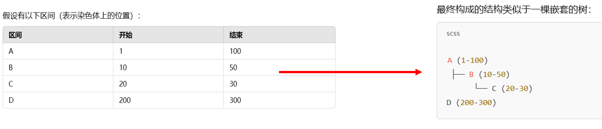
	<BR>
- `GNCList`是`NCList`的扩展版本，专门用于处理带有基因组序列名称（**seqnames**）的范围对象。

	| 特性       | `NCList`       | `GNCList`                    |
	| -------- | -------------- | ---------------------------- |
	| **适用范围** | 无染色体信息，仅处理一般范围 | 适用于带有染色体（`seqnames`）信息的基因组范围 |
	| **分组**   | 无需分组，仅使用嵌套结构   | 按染色体分组，每个组内使用 NCList         |
	| **性能**   | 适用于小型范围数据      | 针对大型基因组数据优化，避免跨染色体比较         |

<BR>

- `findOverlaps()` 和 `countOverlaps()`会自动对 subject 创建 `NCList`和`GNCList`，以优化重叠计算的效率。用户通常无需手动构建 `NCList`和`GNCList`。
  

```R
# creat nclist and gnclist

# 当你处理像环状染色体（如线粒体 DNA）数据时
# circle.length定义了“环长
# 当区间超出边界时，使用 circle.length 可以让区间“回到起点”，模拟环状数据
nclist <- NCList(ir,
                 #circle.length=NA_integer_
                   )

gnclist <- GNCList(subject)

nclist
gnclist
```

```text
NCList object with 3 ranges and 0 metadata columns:
          start       end     width
      <integer> <integer> <integer>
  [1]         1        13        13
  [2]         3         7         5
  [3]        20        25         6
GNCList object with 3 ranges and 1 metadata column:
    seqnames    ranges strand |     score
       <Rle> <IRanges>  <Rle> | <numeric>
  A     chr1   150-250      + |        20
  B     chr1   175-450      + |        40
  C     chr2   550-650      + |        20
  -------
  seqinfo: 2 sequences from an unspecified genome; no seqlengths
```

<br>

---
## TxDb and EnsDb

### TxDb object

- `TxDb` (Transcript Database) is a object provided by Bioconductor for storing annotation information of genomes
    <br>
- you can download from `Bioconductor`

	```R
	# loading packages
	library(AnnotationHub)
	
	# downland AnnotationHub database
	AH <- AnnotationHub()
	
	# Query all available Txdb databases
	query(AH , "Txdb.Rnorvegicus.UCSC.rn6")
	```
	
	```text
	AnnotationHub with 6 records
	# snapshotDate(): 2024-10-28
	# $dataprovider: UCSC
	# $species: Rattus norvegicus
	# $rdataclass: TxDb
	# additional mcols(): taxonomyid, genome, description, coordinate_1_based, maintainer,
	#   rdatadateadded, preparerclass, tags, rdatapath, sourceurl, sourcetype 
	# retrieve records with, e.g., 'object[["AH52270"]]' 
	
	            title                                      
	  AH52270 | TxDb.Rnorvegicus.UCSC.rn6.refGene.sqlite   
	  AH53781 | TxDb.Rnorvegicus.UCSC.rn6.refGene.sqlite   
	  AH61799 | TxDb.Rnorvegicus.UCSC.rn6.refGene.sqlite   
	  AH66179 | TxDb.Rnorvegicus.UCSC.rn6.refGene.sqlite   
	  AH70598 | TxDb.Rnorvegicus.UCSC.rn6.refGene.sqlite   
	  AH84143 | TxDb.Rnorvegicus.UCSC.rn6.ncbiRefSeq.sqlite
	```
	
	According to **AH ID** to downland database
	```R
	# According to AH ID to downland database
	# A larger AH ID indicates a newer version.
	TxDb <- AH[["AH70598"]]
	```

  <br>
* you can use `GFF/GTF` to build `TxDb` object  

	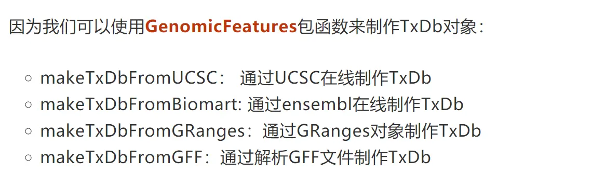
	```R
	# loading packages
	library(GenomicFeatures)
	
	# makeTxDb
	TxDb <- makeTxDbFromGFF("./Rattus_norvegicus.mRatBN7.2.113.gtf")	
	```

<BR>

### EnsDb

- 我们还可以使用 **Ensembl-based `EnsDb` 注释数据库（由 [ensembldb](http://127.0.0.1:28103/session/Rvig.861c7c7c45e9.html) 包提供）作为`TxDb` objects 进行输入

- 但需要用`seqlevelsStyle()` 对染色体名称进行转换

|特性|`EnsDb`|`TxDb`|
|---|---|---|
|**数据来源**|Ensembl数据库的基因组注释数据|多种注释源（如UCSC、NCBI）|
|**数据内容**|基因、转录本、外显子、CDS等全面信息|主要包含转录本信息，如外显子、内含子|
|**适用场景**|基因组级别的分析，特别是Ensembl注释|转录本分析，关注转录本结构与功能|
```R
# loading packages
library(ensembldb)

# downland AnnotationHub database
AH <- AnnotationHub()

# Query all available Txdb databases
# This 113 is the version number for the EnsDb database
query(AH, "113 EnsDb for Rattus norvegicus")

# According to AH ID to downland database
edb <- AH[["AH119437"]]

# Change the chromosome names to UCSC style
seqlevelsStyle(edb) <- "UCSC"
```
<br>

---
## GFF(GFF3) and GTF(GTF2)

**[基因组注释文件(GFF,GTF)下载的五种方法](https://blog.csdn.net/u011262253/article/details/89363809)**


### GFF(GFF3)

- `GFF`(General Feature Format)是一种用来描述基因组特征的文件
  
- 现在我们所使用的大部分都是第三版（`[GFF3](https://gmod.org/wiki/GFF3)`）
  
    ```text
    ctg123 . mRNA            1300  9000  .  +  .  ID=mrna0001;Name=sonichedgehog
    ctg123 . exon            1300  1500  .  +  .  ID=exon00001;Parent=mrna0001
    ctg123 . exon            1050  1500  .  +  .  ID=exon00002;Parent=mrna0001
    ctg123 . exon            3000  3902  .  +  .  ID=exon00003;Parent=mrna0001
    ctg123 . exon            5000  5500  .  +  .  ID=exon00004;Parent=mrna0001
    ctg123 . exon            7000  9000  .  +  .  ID=exon00005;Parent=mrna0001
    ```
    
	|列名|描述|
	|---|---|
	|seqid|参考序列的 ID|
	|source|该特征的来源，未知时用 `.` 代替|
	|type|特征类型，如 `gene`、`exon`、`CDS` 等，建议使用 SO 术语|
	|start|起始坐标（1-based）|
	|end|终止坐标|
	|score|量化得分，空值用 `.` 代替|
	|strand|`+` 表示正链，`-` 表示负链，`.` 表示无方向要求|
	|phase|CDS 需要此列，当前 CDS 片段的起始碱基在密码子中的偏移量。它的值可以是 0、1 或 2|
	|attributes|属性列表，格式为 `key=value`，不同属性用 `;` 分隔|
    

<br>

### GTF (GTF2)

- `GTF`(gene transfer format)，主要是用来对基因进行注释
  
- 当前所广泛使用的GTF格式为第二版（`GTF2`）
  
    ```text
    AB000381 Twinscan  CDS          700   707   .   +   2  gene_id "AB000381.000"; transcript_id "AB000381.000.1";
    AB000381 Twinscan  exon         900  1000   .   +   .  gene_id "AB000381.000"; transcript_id "AB000381.000.1";
    AB000381 Twinscan  start_codon  380   382   .   +   0  gene_id "AB000381.000"; transcript_id "AB000381.000.1";
    AB000381 Twinscan  stop_codon   708   710   .   +   0  gene_id "AB000381.000"; transcript_id "AB000381.000.1";
    ```
    
	|列名|描述|
	|---|---|
	|seqname|序列 ID，通常是染色体 ID 或 Contig ID|
	|source|该特征的来源，未知时用 `.` 代替|
	|type|特征类型，特征类型，如 `CDS`、`start_codon`(起始密码子)、`stop_codon`（终止密码子） （**这一列必须注明**）|
	|start|起始坐标（1-based）|
	|end|终止坐标|
	|score|量化得分，空值用 `.` 代替|
	|strand|`+` 表示正链，`-` 表示负链，`.` 表示无方向要求|
	|frame|读码框（0、1 或 2，仅适用于 `CDS`）|
	|attributes|其他信息（键值对，`key "value";` 格式）|

<br>

### Different from GFF of GTF

| 对比项           | `GFF3`                                         | `GTF2`                             |
| ------------- | -------------------------------------------------- | -------------------------------------- |
| type/feature  | 必须注明                                               | 可以是任意名称                                |
| attributes    | `key=value`                                        | `key "value"`                          |
| attributes 层级 | 明确层级关系（gene → mRNA → exon/CDS）                     | 层级关系相对不严格                              |
| 支持的特征         | 更丰富（gene, mRNA, exon, CDS, ncRNA, repeat_region 等） | 主要针对转录组数据（gene, transcript, exon, CDS） |
<br>

---
# Genome Coordinate Conversion

## Loading package
```R
# Delete all objects
rm(list = ls())

# Loading package
library(R.utils)      # enhance the basic functions of R.
library(rtracklayer)  # processing genomic data.
library(dplyr)        # Data Processing and Operations
```

<BR>

---

## Processing data

Processing bed file as `GRanges` (`GRanges` objects as input in `liftOver()`

- you can import bed file as dataframe to create `GRanges` object**(Recommend)**。
  
- You should modify the chromosome names to conform to the genome format (e.g., **1** should become **chr1**)
    **UCSC** use **chr1** and **chrM** and version
    
	```R
	    # import bed file as dataframe
	bed_data <- read.csv(file = "./Demo0625.csv")
	
	# remove duplicate
	bed_data <- bed_data %>% distinct(bed_data$name,.keep_all = TRUE)
	
	
	# create GRanges objects
	query <- GRanges(seqnames = bed_data$chr,
	                  ranges = IRanges(start = bed_data$start, 
	                                   end = bed_data$end,
	                                   names=bed_data$name),
	                  score = bed_data$fold_enrichment,
	                  strand="*")
	
	# 修改染色体名称
	seqlevelsStyle(query) <- "UCSC" 
	
	
	query
	```

	```text
	GRanges object with 10714 ranges and 1 metadata column:
	                    seqnames              ranges strand |     score
	                       <Rle>           <IRanges>  <Rle> | <numeric>
	      KChIP2_peak_3     chr1     1193628-1193990      * |   3.49474
	      KChIP2_peak_4     chr1     1670780-1671341      * |   6.46071
	      KChIP2_peak_6     chr1     1784527-1784797      * |   4.72403
	      KChIP2_peak_7     chr1     1803427-1803932      * |   3.62225
	      KChIP2_peak_8     chr1     1925707-1926101      * |   2.62105
	                ...      ...                 ...    ... .       ...
	  KChIP2_peak_21434     chrX 158978724-158979272      * |   4.24629
	  KChIP2_peak_21436     chrX 159126572-159127036      * |   3.43400
	  KChIP2_peak_21437     chrX 159157346-159157724      * |   3.72489
	  KChIP2_peak_21438     chrX 159428723-159429014      * |   2.62105
	  KChIP2_peak_21441     chrX 159890957-159891282      * |   2.62105
	  -------
	  seqinfo: 22 sequences from an unspecified genome; no seqlengths
	```

-  you can use `import()` function to directly import bed file as GRange object**(NOT recommend)**。
	```R
	query <- import("./Demodata.bed")
	```

<BR>

---
## Chain file

`Chain file` is a file format used to represent **sequence alignments between different genome assemblies** of the same species or between different species.

<BR>

### Loading chain file

- **[UCSC](https://hgdownload.soe.ucsc.edu/downloads.html)** [chain file download web](https://hgdownload.soe.ucsc.edu/downloads.html) **(Recommend)**
    **(choose species ------choose genome version-----choose LifeOver files)**
    <BR>
- **[Ensembl](https://sourceforge.net/projects/crossmap/files/Ensembl_chain_files/)** [chain file download web](https://sourceforge.net/projects/crossmap/files/Ensembl_chain_files/) **(Only have human and mouse)**

```R
# decompressing chain file
if (file.exists("rn6ToRn7.over.chain")) {
  print("文件解压成功！")
} else {
  gunzip("rn6ToRn7.over.chain.gz")
  print("文件重新解压完成。")
}


# read chain file
chain_file <- import.chain("rn6ToRn7.over.chain")
```

<BR>

### Structure of chain file

[Reference](https://genome.ucsc.edu/goldenpath/help/chain.html)

A `chain file` is generated by **alignment** two genomes

* `chain file`里面包含许多块**chain(同源的地方)**

	- each **chain** represents an alignment between two genomic regions
	    <br>
	- 其中每块**chain** 由**Header Line** 和 **Alignment Data Lines**组成
	    <br>
	- 第一行`Header Line`记录**chain**在两个版本中坐标，
	    <br>
	- 后面许多行`alignment data line`记录具体比对情况。
	```text
	chain 4900 chrY 58368225 + 25985403 25985638 chr5 151006098 - 43257292 43257528 1
	9 1 0
	10 0 5
	61 4 0
	16 0 4
	42 3 0
	16 0 8
	14 1 0
	3 7 0
	48
	
	chain 4900 chrY 58368225 + 25985406 25985566 chr5 151006098 - 43549808 43549970 2
	16 0 2
	60 4 0
	10 0 4
	```

<br>

#### Header Line
```text
chain score tName tSize tStrand tStart tEnd qName qSize qStrand qStart qEnd id 
```

- `score` -- chain score （How well the two sequences allign）
  
- `tName` -- chromosome (reference/target sequence)
  
- `tSize` -- chromosome size (reference/target sequence)
  
- `tStrand` -- strand (reference/target sequence)
  
- `tStart` -- alignment start position (reference/target sequence)
  
- `tEnd` -- alignment end position (reference/target sequence)
  
- `qName` -- chromosome (query sequence)
  
- `qSize` -- chromosome size (query sequence)
  
- `qStrand` -- strand (query sequence)
  
- `qStart` -- alignment start position (query sequence)
  
- `qEnd` -- alignment end position (query sequence)
  
- `id` -- chain ID

<br>

#### Alignment Data Lines
```text
size dt dq 
```
- Alignment Data Lines 将 chain分成许多个 **block**(一致的区域)(对齐块)，每一行代表一个**block**
  
- `size` -- the size of the ungapped alignment **(block)**
  
- `dt` -- the difference between the end of this **block** and the beginning of the next **block** **(reference/target sequence)**
  
- `dq` -- the difference between the end of this **block** and the beginning of the next **block** **(query sequence)**
```text
     chain 4900 chrY 58368225 + 25985406 25985566 chr5 151006098 - 43549808 43549970 2
     16      0       2
     60      4       0
     10      0       4
     70 
```


<br>

---
## Genome Coordinate Conversion

We can use function of `liftOver()` to transformGenome Coordinate Conversion in R
```r
# liftover
subject <- liftOver(query, chain_file)

# convert to dataframe
 subject_data <- as.data.frame(subject)

```

<br>

---
## Merge separate peaks

- Filter and merge peaks by setting `distance_threshold` and `minimum_width`
  
- 这个`distance_threshold`与`minimum_width`值需要自己把握，需要根据实际情况进行判断**
  
- 这个方法是我一时半了想出来，如果有好的想法可以进行添加与修改。

<br>
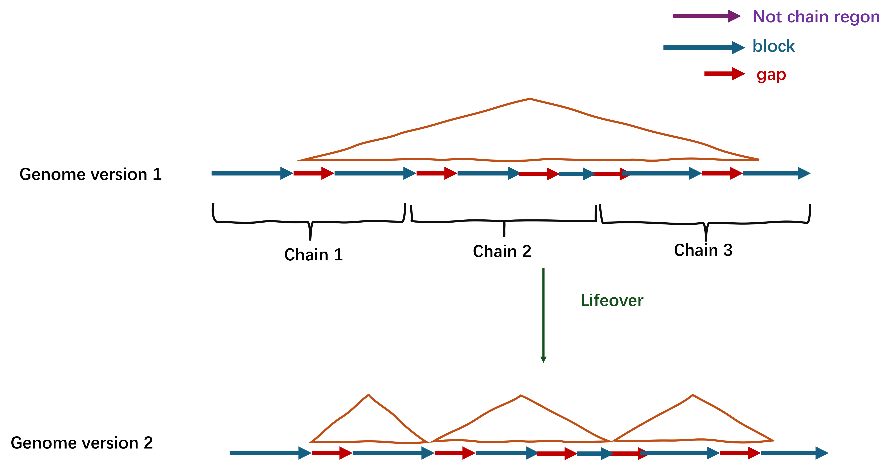
<br>

<br>

### Per setting
```R
# setting distance_threshold (base)
distance_threshold <- 30

# setting minimum width of peaks (base)
minimum_width <- 30
```

<BR>

### Function of merge peaks by group
We made a `merge_peaks_by_group`function to merge peaks by same group
```R
merge_peaks_by_group <- function(df, distance_threshold) {
  df %>%
    group_by(group) %>%  # 按 group 分组
    filter(n_distinct(seqnames) == 1) %>%  # 只保留同一组内染色体相同的行
    arrange(group, start) %>%  # 按照 start 位置排序
    mutate(
      dist_to_prev = start - lag(end, default = first(end))  # 增加dist_to_prev这列，其为当前 start 和前一个 peak 的 end 之间的距离
    ) %>%
    ungroup() %>%  # 取消分组，以便下一步操作
    mutate(
      merge_group = cumsum(dist_to_prev > distance_threshold | is.na(dist_to_prev))  # 增加merge_group列，如果距离大于阈值，增加1（不合并）
    ) %>%
    group_by(group, merge_group) %>%  # 按照 group 和新的merge_group进行分组
    summarise(
      group_name = first(group_name),  # 保留第一个 group_name
      seqnames = first(seqnames),
      start = min(start),  # 取最小的 start
      end = max(end),  # 取最大的 end
      width = end - start+1,  # 计算新的 width
      strand = first(strand),  # 保留第一个 strand
      score = first(score),  # 保留第一个 score
      .groups = "drop"  # 去掉分组结构
    )
}
```

<br>

Use `merge_peaks_by_group`function
```r
merge_peaks_subject <- merge_peaks_by_group(subject_data,distance_threshold)
```

### Remove narrow width of peaks

- Evaluate the change in width after `liftOver` to assess the quality of merged peaks
  
- peak whose width **increases too much** after `liftOver` is **removed**
```r
# Extract original width
before_width <- bed_data[,c(22,4)]
colnames(before_width) <- c("group_name","before_width")


# merge original width 
merge_peaks_subject <- merge(merge_peaks_subject,before_width,by.x="group_name",by.y="group_name")


# calculate the change in width after liftOver to assess the quality
merge_peaks_subject$width_change <- merge_peaks_subject$width/merge_peaks_subject$before_width*100


# remove narrow width of peaks
merge_peaks_subject <- filter(merge_peaks_subject,merge_peaks_subject$width>=minimum_width)
```

<br>

---
# Peak overlap

## Loading package
```r
# Delete all objects
rm(list = ls())

# Loading package
library(GenomicRanges)
library(ChIPpeakAnno)
```

- `GenomicRanges`是R语言中一个强大而灵活的生物信息学包，主要用于**处理基因组区间数据**
  
- `ChIPpeakAnno` 是一个专注于 ChIP-seq 数据分析的 R 包，广泛用于分析和注释染色质免疫沉淀 (ChIP) 实验检测的峰数据。它提供了一系列强大的工具，用于**峰重叠分析、基因注释、功能富集分析和可视化等**。

<br>

---
## Find the overlaps

- `findOverlaps()` 和 `countOverlaps()`会自动对 subject 创建 **NCList**和**GNCList**，以优化重叠计算的效率。用户通常无需手动构建 **NCList**和**GNCList**。

<br>

### findOverlaps()

We use `findOverlaps()` to find the overlaps

```r
# creat two GRanges object
query <- GRanges(seqnames = c("chr1","chr1","chr1"),
                  ranges = IRanges(start = c(100, 300, 500), 
                                   end = c(200, 400, 600),
                                   names=c("a","b","c")),
                  score = c(10, 20, 30),
                  strand="+")

subject <- GRanges(seqnames = c("chr1", "chr1", "chr2"),
                  ranges = IRanges(start = c(150, 175, 550), 
                                   end = c(250, 450, 650),
                                   names=c("A","B","C")),
                  score = c(20, 40, 20),
                  strand="+")
```

```r
hits <- findOverlaps(query, #  query GRanges object
                         subject, #  subject GRanges object
                         type="any",
                         #minoverlap=1, # 两个区域之间的最小重叠碱基数
                         #maxgap=0, # 允许重叠区域之间的最大间隙
                         ignore.strand= F, # F means strand ising considered
                         select="all",
                         # invert=TRUE #If True, keep only the ranges in x that do not overlap ranges
                         )
```

<br>

- `type`
  
    - `any`: 认为query和subject存在任意的重合即认为发生了重叠**（deafult）**
      
    - `within`: 认为query只有完全在subject内才认为是重叠
      
    - `start`: 认为query中的start位置在subjectt内才认为是重叠
      
    - `end`: 认为query中的end位置在subject内才认为是重叠
      
    - `equal`：认为query中的start，end与subject完全相同才认为是重叠
      
    - When type is "`any`", at least one of maxgap and minoverlap must be set to its default value.
	

<br>

- `maxgap and minoverlap`
  
    - **Positive Values of maxgap：**if `maxgap = 50`, two ranges can be up to 50 base pairs apart and still be considered overlapping
      
    - **Negative Values of maxgap**： if `maxgap = -20`, the two ranges must overlap by at least 20 base pairs.
      
    - `minoverlap`：**Only ranges with a minimum of `minoverlap` overlapping positions are considered to be overlapping.
	

<br>

- `select`
  
    - `all`: Return all overlaps **(default)**.
      
    - `first`: Return the first overlap for each **query range**
      
    - `last`: Return the last overlap for each **query range**
      
    - `arbitrary`: Return one arbitrary overlap for each **query range**
	

<br>

### hits objects

- The function of `findoverlaps()` function will creat `hits` ** objects**

	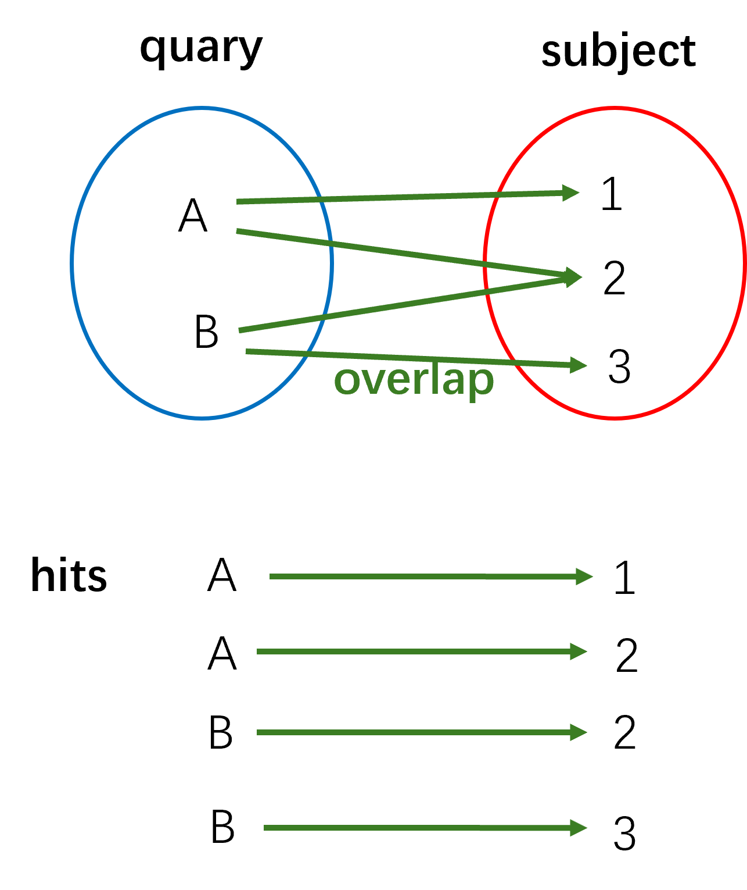

```r
hits
```

```text
Hits object with 3 hits and 0 metadata columns:
      queryHits subjectHits
      <integer>   <integer>
  [1]         1           1
  [2]         1           2
  [3]         2           2
  -------
  queryLength: 3 / subjectLength: 3
```

<br>

- We can use `countQueryHits()`extracting numbers of overlap of query range**
  Using `countSubjectHits()` extracting numbers of overlap of subject range

	```r
	# Query
	countQueryHits(hits)
	setNames(countQueryHits(hits), seqnames(subject))
	
	# subject
	countSubjectHits(hits)
	setNames(countSubjectHits(hits), seqnames(subject))
	```
	
	```text
	[1] 2 1 0
	chr1 chr1 chr2 
	   2    1    0 
	[1] 1 2 0
	chr1 chr1 chr2 
	   1    2    0
	```
<br>

* Using `overlapsRanges()` to check the Specific range of overlaps
```r
GenomicRanges::intersect(query, subject)
```

```text
GRanges object with 2 ranges and 0 metadata columns:
      seqnames    ranges strand
         <Rle> <IRanges>  <Rle>
  [1]     chr1   150-200      +
  [2]     chr1   300-400      +
  -------
  seqinfo: 2 sequences from an unspecified genome; no seqlengths
```
<br>

### countOverlaps()

- `countOverlaps()`可以直接查看query与subject重叠的数目
  
- `countOverlaps()` **占用的内存非常少，再快速查看重叠数目非常有用**
  
- `countOverlaps()` 用法与`findOverlaps`一样

```r
overlap_counts <- countOverlaps(query, subject)
overlap_counts
```

```text
a b c 
2 1 0
```

<br>

### Extract the overlapping peaks

The function of `pintersect()` find the overlapping portion of each range in one set with its paired range in other set

```r
# Extract overlapping ranges
overlap_ranges <- pintersect(query[queryHits(hits)], 
                             subject[subjectHits(hits)])

# caulating the mean score
mean_scores <- rowMeans(cbind(
  query$score[queryHits(hits)],
  subject$score[subjectHits(hits)]
))

# # Add the mean scores as metadata to the overlap ranges
overlap_ranges$score <- mean_scores

overlap_ranges
```

```text
GRanges object with 3 ranges and 2 metadata columns:
    seqnames    ranges strand |     score       hit
       <Rle> <IRanges>  <Rle> | <numeric> <logical>
  a     chr1   150-200      + |        15      TRUE
  a     chr1   175-200      + |        25      TRUE
  b     chr1   300-400      + |        30      TRUE
  -------
  seqinfo: 1 sequence from an unspecified genome; no seqlengths
```

<br>

### Find Overlaps with ≥50%(threshold)
```r
# setting the threshold
threshold=0.5


# exact the overlap_widths
overlap_widths <- width(overlap_ranges)


# Calculate widths of query and subject ranges
query_widths <- width(query[queryHits(hits)])
subject_widths <- width(subject[subjectHits(hits)])


# Filter overlaps with at least threshold overlap
keep <- (overlap_widths / query_widths >= threshold) | 
        (overlap_widths / subject_widths >= threshold)


# Subset the overlaps
threshold_hits <- hits[keep]


# Extract the filtered intersected ranges
threshold_overlap_ranges <- pintersect(query[queryHits(threshold_hits)], 
                                          subject[subjectHits(threshold_hits)])


# check the result
threshold_overlap_ranges
```

```text
GRanges object with 2 ranges and 2 metadata columns:
    seqnames    ranges strand |     score       hit
       <Rle> <IRanges>  <Rle> | <numeric> <logical>
  a     chr1   150-200      + |        10      TRUE
  b     chr1   300-400      + |        20      TRUE
  -------
  seqinfo: 1 sequence from an unspecified genome; no seqlengths
```

<br>

---
## findOverlapsOfPeaks()

- `findOverlapsOfPeaks()` 是 `ChIPpeakAnno` 包提供的一个函数，用于在峰文件中查找多个组间的重叠区域，用法类似于`findOverlaps()`
  
- `findOverlapsOfPeaks()`相比`findOverlaps()` 支持**Vene图可视化，peak注释，peak可视化等功能**。
  
- `findOverlapsOfPeaks()` 会生成一个 `overlappingPeaks` **list.**

```r
query <- GRanges(seqnames = c("chr1","chr1","chr1","chr1","chr1"),
                 ranges = IRanges(start = c(100, 300, 500, 100, 135), 
                                  end = c(200, 400, 600, 400, 334),
                                  names=c("a","b","c","d","e")),
                 score = c(10, 20, 30, 24, 32),
                 strand="+")

subject <- GRanges(seqnames = c("chr1", "chr1","chr1","chr1"),
                   ranges = IRanges(start = c(150, 175, 550,700), 
                                    end = c(250, 450, 650,750),
                                    names=c("A","B","C","D")),
                   score = c(20, 40, 20,30),
                   strand="+")
```

```r
overlappingPeaks <- findOverlapsOfPeaks(query,
                                     subject,
                                     maxgap=0, # 允许重叠区域之间的最大间隙
                                     minoverlap=0.5, # 两个区域之间的最小重叠百分比
                                     ignore.strand= F, # F means strand ising considered
                                     connectedPeaks="keepAll")
```

* 值得注意：这里的`minoverlap`与`findOverlaps()` 不同：`findOverlaps()`指最小重叠base pairs。这里指的是的是overlap最小百分比(0 < `minoverlap` < 1)
<br>
- `connectedPeaks`:
  
    - if 5 peaks in query overlap with 2 peaks in subject
      
    - setting it to `merge` will add 1 to the `Counts`
      
    - setting it to `keepAll` will add 5 peaks to `count.query`, 2 to `count.subject`, and 2 to `Counts`
      
    - setting it to `min` will add 2 to the `Counts`
      
    
    这里的`Counts`是指** `overlappingPeaks` **list 中的** `venn_cnt` object，用于韦恩图画图用
	```r
	overlappingPeaks[["venn_cnt"]]
	```

	```text
	     query subject Counts count.query count.subject
	[1,]     0       0      0           0             0
	[2,]     0       1      1           0             1
	[3,]     1       0      0           0             0
	[4,]     1       1      3           5             3
	attr(,"class")
	[1] "VennCounts"
	```

	
	
	`count.query`在 query 中有多少个peaks与 subject 中的peaks发生了重叠。
	`count.subject`在 subject 中有多少个peaks与 query 中的peaks发生了重叠。
	`Counts`在 `keepAll` 与 `min` 指`count.query`与`count.subject`最小值，在 `merge` 指是将重叠的peaks合并为一个单一计数的结果。
	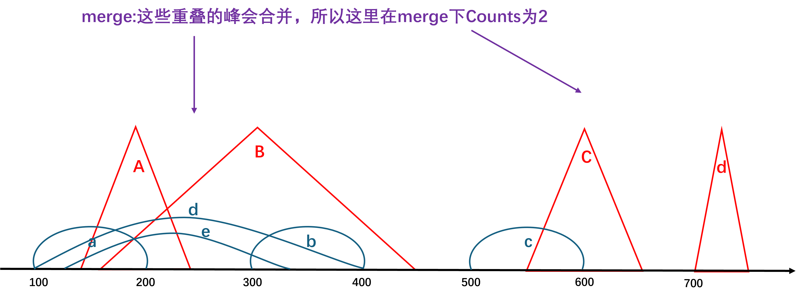

<br>

---
## overlappingPeaks list

`overlappingPeaks` list 由以下objects构成

- `venn_cnt` :** an **object** of `VennCounts` ，用于韦恩图画图用
  
- `peaklist`：** a **list** of `GRanges` object which contain all **overlapping peaks** or **unique peaks**
  
- `uniquePeaks`：** an **object** of `GRanges` consists of all **unique peaks**
  
- `mergedPeaks`：** an **object** of `GRanges` consists of all **merged overlapping peaks**
  
- `peaksInMergedPeaks`：** an **object** of `GRanges` consists of all peaks in each samples involved in the overlapping peaks
  
- `overlappingPeaks`：** a **list** of **data frame** consists of the annotation of all the overlapped peaks
  
- **all.peaks：** a **list** of `GRanges` object which contain the **input peaks** with **formated rownames**.


<br>

---
## Draw a vennDiagram

- `makeVennDiagram()` from packages of `ChIPpeakAnno`
  
- `makeVennDiagram()` :Making Venn Diagram from two or more peak ranges, Also calculate p-value to determine whether those peaks overlap significantly.
```r
# per setting
# color
col = rainbow(2)
```

```r
VennDiagram <- makeVennDiagram(
               Peaks = list(query, subject),
               NameOfPeaks = c("query", "subject"),
               maxgap = 0L, # 允许重叠区域之间的最大间隙
               minoverlap = 0.5, # 两个区域之间的最小重叠百分比
               totalTest = 1000, # 设置总测试次数，用于计算 p 值，It should be much larger than the number of peaks in the largest peak set.
               by = "region", 
               ignore.strand = T,
               connectedPeaks = "merge",
               method = "hyperG",
               # TxDb = TxDb #  TxDb objects   
               plot = TRUE,  # a venn diagram is plotted
               
               # venn plot setting
               alpha= 0.3, # 透明度
               scaled = T, # 根据比例显示大小
               
               lwd=1, # 圆圈线条粗细
               lty=1, # 圆圈线条形状: 1 实线, 2 虚线
               col=col, #圆圈线条颜色: blank无线条
               fill= col, # fill color
               
               # numeric labels
               cex = 1,  # Size
               label.col ='black', # color
               fontface = "bold", # 字体粗细；加粗bold

               # category labels
               cat.cex = 1, # Size
               cat.dist = 0.02, # 标签距离圆圈的远近
               cat.pos = -180, # 标签相对于圆圈的角度cat.pos = c(-10, 10, 135)
               cat.fontface = "bold",  # 标签字体加粗
               cat.default.pos = "text"  # 标签位置, outer内;text 外
)
```

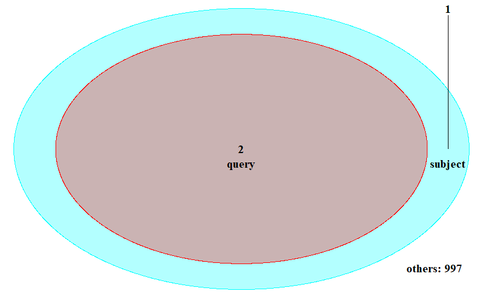

<br>

- `by`
  
    * `feature` : means using feature field (such as Promoter, exon) for calculating overlap
    
    * `region`(default): means using chromosome range for calculating overlap,
    
    * `base`: means calculating overlap in nucleotide level.
    <br>
- `connectedPeaks`
	- 这里的`connectedPeaks`多了一个参数：
    
    `keepFirstListConsistent` will keep the counts consistent with first list.
    <br>
- `method`：method to be used for p value calculation
  
    - `hyperG`（超几何检验）：超几何分布会计算出随机情况下抽中某个重叠的概率。
      
    - `permutation`（置换检验）：你将这些数据打乱多次（如：将 query 和 subject 中的峰随机分配到整个 1000个区间），每次都计算一次重叠情况。然后，你比较原始数据的重叠和这些随机打乱后的重叠结果。如果原始数据的重叠结果比打乱后的结果显著（即更极端或更大），那么说明重叠结果是显著的，不太可能是偶然的。

<br>

---
# peak Annotation, Comparison and Visualization
## Loading packages
```r
# Delete all objects
rm(list = ls())

# Loading packages
library(ChIPseeker)      # for ChIP peak Annotation, Comparison and Visualization
library(dplyr)           # Data Processing and Operations
library(rtracklayer)     # processing genomic data
library(ggplot2)         # Data Visualization
library(org.Rn.eg.db)    # wide annotation database of Genome,choise your species
library(AnnotationHub)   # Query the annotation database
library(clusterProfiler) # enrichment analysis

library(knitr)      # for creating tables in RMarkdown
library(kableExtra) # for enhancing table styling
library(reactable)  # beautiful table
```

<br>

---

## Date processing
```r
# 定义BED文件路径和peak name
bed_files <- c("./Demo0625.csv", "./Demo1011.csv")
peak_name <- c("peak0625", "peak1011")

# 初始化一个空列表，用于存储每个文件的GRanges对象
peak_list <- list()

# 循环加载每个BED文件并转换为GRanges对象
for (i in seq_along(bed_files)) {
  
  # 读取BED文件
  bed_data <- read.csv(file = bed_files[i])
  
  # 去除重复行
  bed_data <- bed_data %>% distinct(name, .keep_all = TRUE)
  
  # 创建GRanges对象
  peak <- GRanges(
    seqnames = bed_data$chr,
    ranges = IRanges(
      start = bed_data$start,
      end = bed_data$end,
      names = bed_data$name
    ),
    score = bed_data$fold_enrichment,
    strand = "*"
  )
  
  # 修改染色体名称
  seqlevelsStyle(peak) <- "UCSC" 
  
  # 将GRanges对象添加到列表中，并使用对应的peak_name命名
  peak_list[[peak_name[i]]] <- peak
  
  rm(peak)
  rm(bed_data)
}

# 查看结果
peak_list
```

```text
$peak0625
GRanges object with 10714 ranges and 1 metadata column:
                    seqnames              ranges strand |     score
                       <Rle>           <IRanges>  <Rle> | <numeric>
      KChIP2_peak_3     chr1     1193628-1193990      * |   3.49474
      KChIP2_peak_4     chr1     1670780-1671341      * |   6.46071
      KChIP2_peak_6     chr1     1784527-1784797      * |   4.72403
      KChIP2_peak_7     chr1     1803427-1803932      * |   3.62225
      KChIP2_peak_8     chr1     1925707-1926101      * |   2.62105
                ...      ...                 ...    ... .       ...
  KChIP2_peak_21434     chrX 158978724-158979272      * |   4.24629
  KChIP2_peak_21436     chrX 159126572-159127036      * |   3.43400
  KChIP2_peak_21437     chrX 159157346-159157724      * |   3.72489
  KChIP2_peak_21438     chrX 159428723-159429014      * |   2.62105
  KChIP2_peak_21441     chrX 159890957-159891282      * |   2.62105
  -------
  seqinfo: 22 sequences from an unspecified genome; no seqlengths

$peak1011
GRanges object with 10019 ranges and 1 metadata column:
                       seqnames              ranges strand |     score
                          <Rle>           <IRanges>  <Rle> | <numeric>
      KChIP2-OE_peak_2     chr1       747955-748316      * |   2.84924
      KChIP2-OE_peak_5     chr1     1671192-1671604      * |   3.73480
      KChIP2-OE_peak_6     chr1     1767207-1767799      * |   4.68312
      KChIP2-OE_peak_7     chr1     1944415-1944899      * |   5.71260
      KChIP2-OE_peak_8     chr1     1952088-1952383      * |   2.84924
                   ...      ...                 ...    ... .       ...
  KChIP2-OE_peak_22997     chrX 159037695-159038091      * |   4.70768
  KChIP2-OE_peak_22999     chrX 159437682-159437965      * |   3.56155
  KChIP2-OE_peak_23001     chrX 159816201-159816424      * |   3.56155
  KChIP2-OE_peak_23002     chrX 159890739-159891449      * |   4.27386
  KChIP2-OE_peak_23003     chrY       525379-525712      * |   2.84924
  -------
  seqinfo: 23 sequences from an unspecified genome; no seqlengths
```

***
## Loading Txdb

`Txdb` detail you can see  🪨[[#TxDb and EnsDb]] 🔗[TxDb and EnsDb](#TxDb-and-EnsDb)

```r
# downland AnnotationHub database
AH <- AnnotationHub()

TxDb <- AH[["AH70598"]]
```


<br>

---
## Peaks coverage plot
- After peak calling, we would like to know the peak locations **over the whole genome**

	```r
	covplot(peak_list[[1]], weightCol="score")
	```
	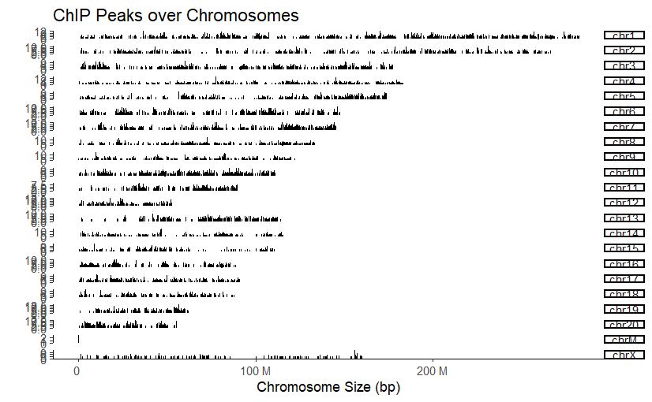

<br>

- we can check peak locations of **region** **of the chromosome**

	```r
	covplot(peak_list[[1]], weightCol="score", chrs=c("chr17", "chr18"), xlim=c(1, 5e7))
	```
	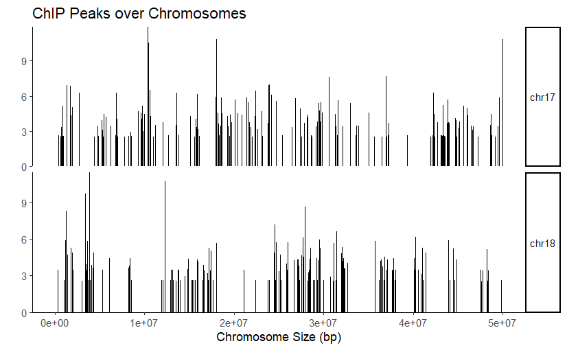


<br>

* We also check peak locations **over the whole genome** with a **list** of `GRangs` objects

	```r
	covplot(peak_list, weightCol = "score", fill_color = c("red","blue")) +
	  theme(legend.position = "inside",
	        legend.position.inside = c(0.8,0.2))
	```
	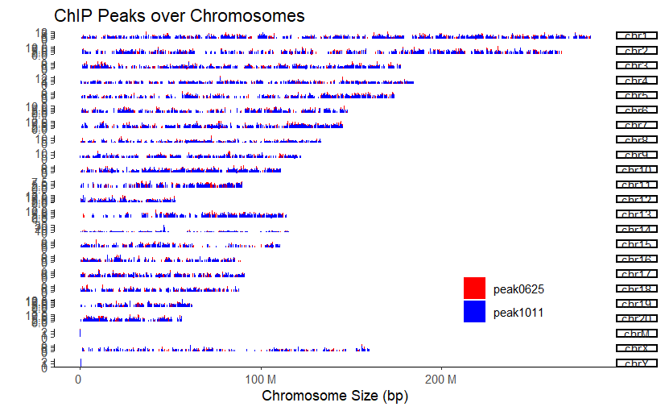

<br>

---
## Upstream and downstream

- we only set `Upstream and downstream` to `500` as an example for only demonstration.User should set according to the actual situation(Deafut: `1000` or `3000`)
    <br>
- `Upstream and downstream` can be set using `rel(0.2)`, which represents an expansion of 20% of the target region's length rather than a fixed bp value. However, when `type = "body"`, using `rel()` will not cause any errors.

<br>

---
## nbin

|分析场景|`nbin` 建议值|说明|
|---|---|---|
|TSS/TES ±2kb 区域|`100` - `400`|适用于小区域，`nbin` 适中可保证平滑曲线|
|整个基因体 (`type = "body"`)|`400` - `1000`|适用于大范围分析|
|超大基因区域（>100kb）|>`1000`|适用于长基因，避免信息丢失|

<br>

---
## Profile of peaks binding to TSS

### TagMatrix

- `TagMatrix`: peaks在基因组区域内的位置分布，并为每个区域(bins)生成一个矩阵
  
    * `TagMatrix` 的**行**代表 **不同的peaks**。
    
    * `TagMatrix` 的**列**代表**区域被划分的 bins**
    <br>
- 假设你对基因的 **转录起始位点（TSS）** 进行分析，并设定 `upstream = 3000`、`downstream = 3000`，且 `nbin = 800`：
  
    - 这 **6000 bp** 被划分为 **800 个 bin**，即 **每个 bin 代表 6000/800 = 7.5 bp** 的区间。
      
    - `TagMatrix[i, j]` 代表 第 i 个 peak 在第 j 个 bin 里的信号值（如读取数或加权值)
    <br>   
- `getTagMatrix()` can get `TagMatrix`from `GRanges` object
```r
tagMatrix <- getTagMatrix(
  peak_list[[1]],       # peak file or GRanges object
  weightCol = "score",  # column name of peak as weight
  TxDb = TxDb,          # TxDb object
  upstream = 500,
  downstream = 500,
  verbose = TRUE,       # print message or not
  ignore_strand = FALSE,# 是否忽略链信息(默认区分正负链)
  
  nbin = 500,          # window region 被划分成多少个 bins（小区间）（用于计算信号密度）
                       # 值越大，分辨率越高，但可能会导致计算时间增加
  
  
  #windows,            # 接提供一个基因组区域(window region)的 GRanges 对象
                       # 适用于分析某个基因的外显子、内含子等特定window region的峰值分布
                       # 如果提供了 windows,那么 upstream 和 downstream 参数会被忽略）
  
  type = "start_site", # 选择绘制区域("start_site"：TSS, Transcription Start Site，
                       #               "end_site"：TES, Transcription End Site
                       #               "body" : Gene Body (整个基因体))
  
  by = "gene"         # 按'gene', 'transcript', 'exon', 'intron' , '3UTR' , '5UTR', 'UTR'进行分析
)
```

<br>

* `TagMatrix` structure
```r
tagMatrix[c(1:10),c(1:10)]
```

```text
       [,1]    [,2]    [,3]    [,4]    [,5]    [,6]    [,7]    [,8]    [,9]   [,10]
 [1,] 0.00000 0.00000 0.00000 0.00000 0.00000 0.00000 0.00000 0.00000 0.00000 0.00000
 [2,] 5.18626 5.18626 5.18626 5.18626 5.18626 5.18626 5.18626 5.18626 5.18626 5.18626
 [3,] 0.00000 0.00000 0.00000 0.00000 0.00000 0.00000 0.00000 0.00000 0.00000 0.00000
 [4,] 0.00000 0.00000 0.00000 0.00000 0.00000 0.00000 0.00000 0.00000 0.00000 0.00000
 [5,] 0.00000 0.00000 0.00000 0.00000 0.00000 0.00000 0.00000 0.00000 0.00000 0.00000
 [6,] 5.17740 5.17740 5.17740 5.17740 5.17740 5.17740 5.17740 5.17740 5.17740 5.17740
 [7,] 0.00000 0.00000 0.00000 0.00000 0.00000 0.00000 0.00000 0.00000 0.00000 0.00000
 [8,] 0.00000 0.00000 0.00000 0.00000 0.00000 0.00000 0.00000 0.00000 0.00000 0.00000
 [9,] 6.33876 6.33876 6.33876 6.33876 6.33876 6.33876 6.33876 6.33876 6.33876 6.33876
[10,] 0.00000 0.00000 3.35933 6.71866 6.71866 6.71866 6.71866 6.71866 6.71866 6.71866
```

<br>

### Heatmap and peak profiling
* you can use `tagHeatmap()` to create heatmap with `TagMatrix`

	```r
	tagHeatmap(tagMatrix)
	```
	

<br>

* you can use `peakHeatmap()` to create heatmap with  peak file or `GRanges` object

	```r
	peakHeatmap(
	  peak_list[[1]],    # peak file or GRanges object
	  weightCol = "score",  # column name of peak as weight
	  TxDb = TxDb,        # TxDb object
	  upstream = 500,     # upstream position  ,rel(0.2)
	  downstream = 500,   # downstream position
	  xlab = "",         # xlab
	  ylab = "",         # ylab
	  title = NULL,      
	  palette = NULL,    # 颜色方案
	  verbose = FALSE,   # print message or not
	  by = "gene",       # 按'gene', 'transcript', 'exon', 'intron' , '3UTR' , '5UTR', 'UTR'进行分析
	  
	  type = "start_site", # 选择绘制区域("start_site"：TSS, Transcription Start Site，
	                       #        "end_site"：TES, Transcription End Site
	                       #        "body" : Gene Body (整个基因体))
	  
	  nbin = 500,          # window region 被划分成多少个 bins（小区间）（用于计算信号密度）
	                       # 值越大，分辨率越高，但可能会导致计算时间增加
	  
	  ignore_strand = FALSE, # 是否忽略链信息（默认区分正负链）
	  
	  #windows,           # 接提供一个基因组区域(window region)的 GRanges 对象
	                      # 适用于分析某个基因的外显子、内含子等特定window region的峰值分布
	                      # 如果提供了 windows,那么 upstream 和 downstream 参数会被忽略）


​	  
	  ncol = NULL,       # 指定输出的图像列数
	  nrow = NULL        # 指定输出的图像行数
	)
	```
	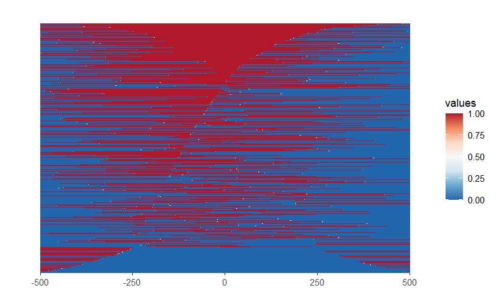

<br>

* `peakHeatmap_multiple_Sets()` can compare of the peak heatmap over **two regions**

	```r
	#提取所有转录本的基因信息
	txdb1 <- transcripts(TxDb)
	
	#仅选择前 10,000 个基因的 5' UTR，避免计算量过大
	txdb2 <- unlist(fiveUTRsByTranscript(TxDb))[1:10000,]
	
	region_list <- list(geneX = txdb1, geneY = txdb2)
	
	peakHeatmap_multiple_Sets(peak_list[[1]],
	                          upstream = 500,
	                          downstream = 500,
	                          by = c("geneX","geneY"),
	                          type = "start_site",
	                          TxDb = region_list,
	                          nbin = 500,
	                          verbose = FALSE)
	```
	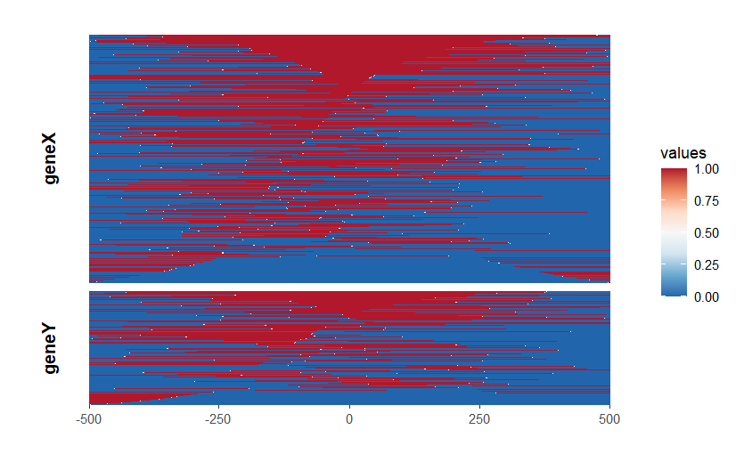

<br>

- `peak_Profile_Heatmap()` can plot heatmap and peak profiling together

	```r
	peak_Profile_Heatmap(peak = peak_list[[1]],
	                     upstream = 500,
	                     downstream = 500,
	                     by = "gene",
	                     type = "start_site",
	                     TxDb = TxDb,
	                     nbin = 500,
	                     verbose = FALSE)
	```
	

<br>

- `peak_Profile_Heatmap()` is also support exploring several regions with heatmap and peak profiling

	```r
	#提取所有转录本的基因信息
	txdb1 <- transcripts(TxDb)
	
	#仅选择前 10,000 个基因的 5' UTR，避免计算量过大
	txdb2 <- unlist(fiveUTRsByTranscript(TxDb))[1:10000,]
	
	region_list <- list(geneX = txdb1, geneY = txdb2)


​	
	peak_Profile_Heatmap(peak = peak_list[[1]],
	                     upstream = 500,
	                     downstream = 500,
	                     by = c("geneX","geneY"),
	                     type = "start_site",
	                     TxDb = region_list,
	                     nbin = 500,
	                     verbose = FALSE)
	```
	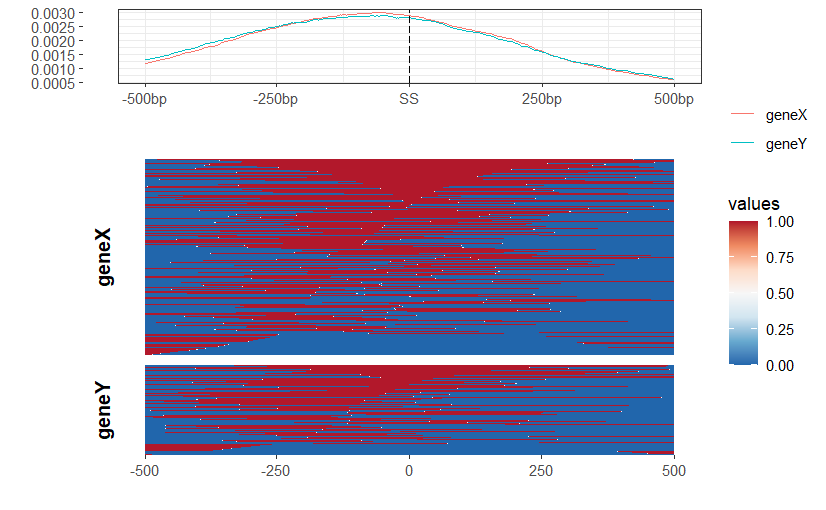

<br>

### Average Profile of peaks binding to TSS region

- `plotAvgProf()` can draw Average Profile of peaks with `TagMatrix`
  
	- **parametets:`conf`(confidence interval): 图中灰色的地方，`conf = 0.95` 表示 期望95%的样本结果落入这个区间

	```r
	plotAvgProf(tagMatrix, 
	            xlim=c(1, 500),   # Need to be smaller than and match your nbin 
	            xlab="Genomic Region (5'->3')", 
	            ylab = "Read Count Frequency" ,
	            conf = 0.95)
	```
	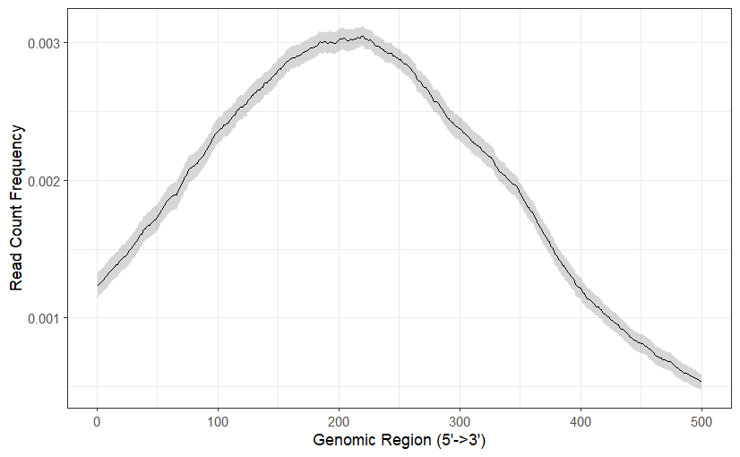

<br>

- `plotAvgProf2()` can draw Average Profile of peaks with **peak file or `GRanges` object**

	```r
	plotAvgProf2(
	  peak_list[[1]],    # peak file or GRanges object
	  weightCol = NULL,  # column name of peak as weight
	  TxDb = TxDb,
	  upstream = 500,
	  downstream = 500,
	  xlab = "Genomic Region (5'->3')",
	  ylab = "Peak Count Frequency",
	  conf = 0.95,        # confidence interval
	  facet = "none",     # 分组："none"（默认）：不分组,"row"：按行分组,"column"：按列分组
	  free_y = TRUE,      # 是否允许 Y 轴自由缩放  
	  verbose = FALSE,    #  print message or not
	  ignore_strand = FALSE,
	)
	```
	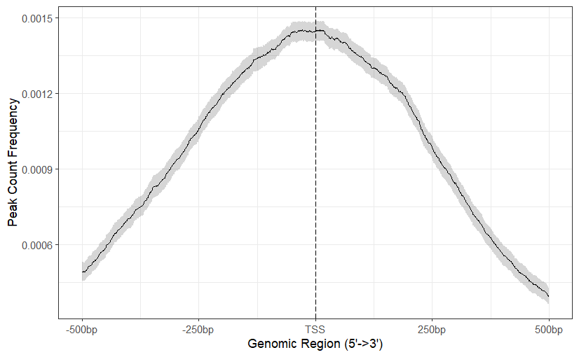

<br>

---
## peak annotation

- `annotatePeak()` is use to annotate the peaks

	```r
	{r}
	peakAnno <-annotatePeak(
	  peak_list[[1]],              # Input peak data (GRanges object)
	  tssRegion = c(-3000, 3000),  # Region around TSS to annotate 
	  TxDb = TxDb,                 # Annotation database (TxDb object)
	  level = "transcript",        # Annotation level ("gene", "transcript")
	  
	  assignGenomicAnnotation = TRUE,  # annotation列是否会报告详细信息
	  
	  # Order of annotation features
	  # 定义注释的优先级，即如果一个 peak 归属于多个区域，优先按这个顺序分配
	  genomicAnnotationPriority = c("Promoter", "5UTR", "3UTR", "Exon", "Intron", "Downstream", "Intergenic"),
	  
	  # External annotation database (optional)
	  annoDb = "org.Rn.eg.db", 
	  
	  # Whether to include flanking gene regions
	  # if addFlankGeneInfo is TRUE，The program will find the nearest gene within a certain distance (flankDistance) to the peak.
	  addFlankGeneInfo = FALSE,  
	  flankDistance = 5000,  


​	  
	  sameStrand = FALSE,  # Consider only the same strand as the gene
	  ignoreOverlap = FALSE,  #  whether ignore overlap of TSS with peak
	  ignoreUpstream = FALSE,  # Ignore upstream regions
	  ignoreDownstream = FALSE,  # Ignore downstream regions
	  
	  # Type of overlap ("TSS" or "all")
	  # overlap = "TSS":(deafult),When the peak covers TSS (transcription start site), the gene is considered to be the nearest gene.
	  # overlap = "all":If the peak falls in any gene region, the gene will be directly considered as the nearest gene without additionally searching for the nearest TSS
	  overlap = "TSS",  
	  verbose = TRUE,  # Whether to print progress messages
	  
	  # Specify the gene information to be output 
	  # (e.g: "ENTREZID", "ENSEMBL", "SYMBOL", "GENENAME")
	  columns = c("ENTREZID", "SYMBOL", "GENENAME")
	)
	```

<br>

- `annotatePeak()` results in `csAnno`（ChIPseeker Annotation)
  
    - `as.GRanges()`: convert to `GRanges` objects。
      
    - `as.data.frame()`: convert to `data.frame`

	```r
	peakAnno_dataframe <- as.data.frame(peakAnno)
	
	peakAnno_dataframe[c(1:6),]
	```

	```text
	seqnames start    end      width strand score   annotation                                     geneChr geneStart geneEnd  geneLength geneStrand geneId transcriptId distanceToTSS SYMBOL   GENENAME
	chr1     1193628  1193990  363   *      3.49474 Intron (NM_001013063/292461, intron 5 of 6)    1       1101965   1116926  14962      2          679825 NM_001161691 -76702        Raet1ll1 retinoic acid early transcript 1L like 1
	chr1     1670780  1671341  562   *      6.46071 Distal Intergenic                              1       1702696   1731210  28515      1          292462 NM_001106217 -31355        Lrp11    LDL receptor related protein 11
	chr1     1784527  1784797  271   *      4.72403 Promoter (<=1kb)                               1       1784078   1817310  33233      1          308265 NM_001134543 449           Lats1    large tumor suppressor kinase 1
	chr1     1803427  1803932  506   *      3.62225 Exon (NM_001134543/308265, exon 4 of 8)        1       1784078   1817310  33233      1          308265 NM_001134543 19349         Lats1    large tumor suppressor kinase 1
	chr1     1925707  1926101  395   *      2.62105 Intron (NM_001108457/361449, intron 12 of 12)  1       1938419   1972918  34500      1          308266 NM_001107469 -12318        Zc3h12d  zinc finger CCCH type containing 12D
	chr1     2352454  2352970  517   *      2.62105 Intron (NM_001108458/361450, intron 7 of 7)    1       2333823   2627475  293653     2          361450 NM_001108458 274505        Ust      uronyl-2-sulfotransferase
	```

<br>

当注释为**Exon**或**Intron**时，且`assignGenomicAnnotation = TRUE`时，`annotatePeak()` 返回的`annotation`列会报告详细信息。

- 例如，Exon (NM_001134543/308265, exon 4 of 8)
  
    * 表示该peak与转录本 **NM_001134543** 的外显子重叠
    
    * 对应的**Entrez ID**为**308265**
    
    * 这个重叠的外显子是该转录本**NM_001134543** 的第4个外显子

<br>

---
## Visualize Genomic Annotation

### Pie plot
```r
plotAnnoPie(peakAnno)
```
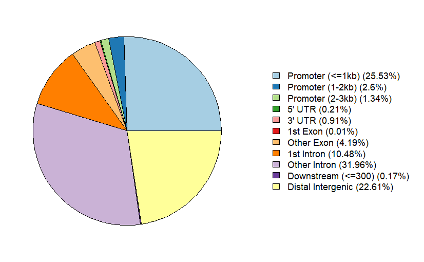

<br>

### Bar plot
```r
plotAnnoBar(peakAnno)
```


<br>

### Ven pie plot
User may interested to view the full annotation with their overlap
```r
vennpie(peakAnno)
```
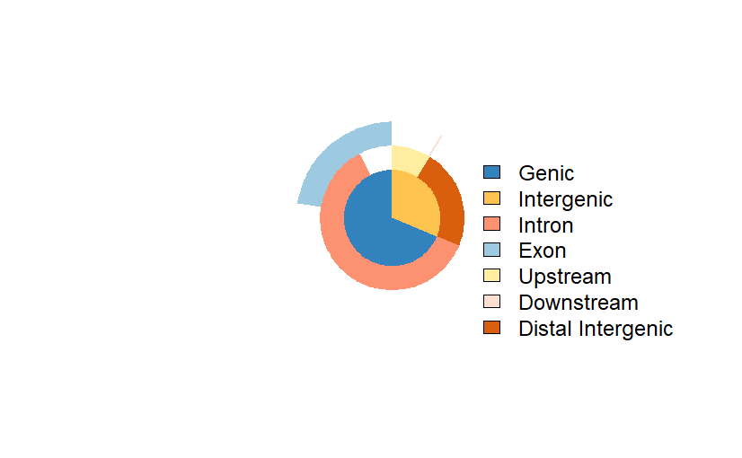

<br>

### Upsetplot()

We extend `UpSetR` to view full annotation overlap. User can user `upsetplot()` function.
```r
upsetplot(peakAnno)
```
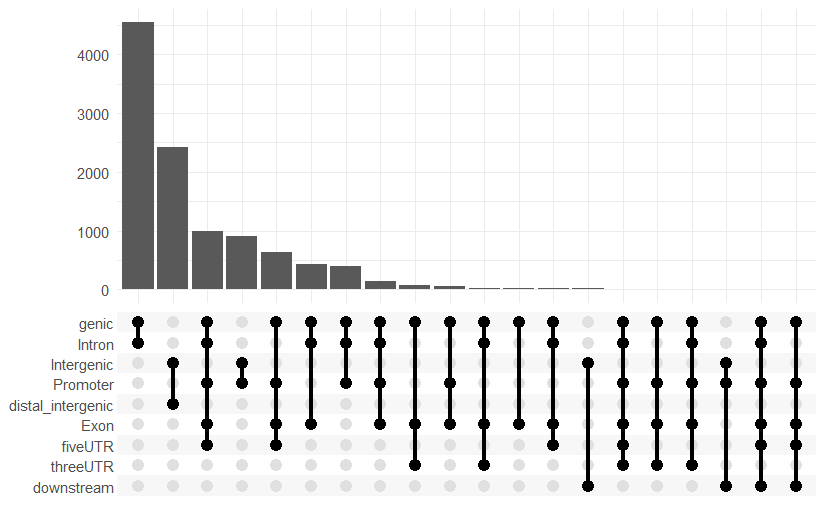

<br>

We can combine `vennpie` with `upsetplot()` by setting `vennpie = TRUE`.
```r
upsetplot(peakAnno, vennpie=TRUE)
```


<br>

### Visualize distribution of TF-binding loci relative to TSS
```r
plotDistToTSS(peakAnno,
              title="Distribution of transcription factor-binding loci\nrelative to TSS")
```


**X 轴**：代表结合位点的百分比（Binding sites (%)），即不同区间内的 TF 结合位点占比

<br>

---

## Functional enrichment analysis

- Detailed enrichment analysis process see **[clusterProfiler](http://bioconductor.org/packages/clusterProfiler)**
    <br>
- you can use gene set of `csAnno` object as input in enrichment analysis

	```r
	library(ReactomePA)
	pathway1 <- enrichPathway(as.data.frame(peakAnno)$geneId)
	```

<br>

- [ChIPseeker](http://bioconductor.org/packages/ChIPseeker) also provides `seq2gene` function, user can use `GRanges` objects as input to get gene set (**Entrez gene ID**)
  
    You can obtain **different genes** by mapping **different associations between gene regions**

	```r
	gene <- seq2gene(peak_list[[1]],                # GRanges object
	                 tssRegion = c(-1000, 1000),    # TSS region
	                 flankDistance = 3000,          # flanking search radius  
	                 TxDb=TxDb,                     # TxDb object
	                 sameStrand = FALSE)            # logical whether find  gene in the same strand
	
	gene[1:20]
	```

```text
 [1] "308265" "361450" "292640" "114490" "308632" "116465" "308923" "293947" "685940" "309565"
[11] "64032"  "65139"  "29517"  "361462" "246769" "498999" "292206" "361191" "290946" "361472"
```

<br>

---
## peak data set comparison

### Profile of several peak data binding to TSS region

- `plotAvgProf()`, `tagHeatmap()` and `plotPeakProf()` can accept a list of `tagMatrix` and visualize profile or heatmap among several Peaks
    <br>
- `plotAvgProf2()`, `peakHeatmap()` and `plotPeakProf2()` can accept a list of **bed files or `GRange` list** and perform the same task
    <br>
- the above function usage see
	- 🪨[[#Heatmap and peak profiling]]   🔗[Heatmap and peak profiling](#Heatmap-and-peak-profiling)
	- 🪨[[#Average Profile of peaks binding to TSS region]]  🔗[Average Profile of peaks binding to TSS region](#Average-Profile-of-peaks-binding-to-TSS-region)

<br>

```r
plotPeakProf2(peak_list, upstream = 3000, downstream = 3000, conf = 0.95,
              by = "gene", type = "start_site", TxDb = TxDb,
              facet = "row", nbin = 800)
```


<br>

### peak annotation comparision

 The `plotAnnoBar()` and `plotDistToTSS()` can also accept input of a **named list of annotated peaks**

```r
# Use lapply to process each element
peakAnnoList <- lapply(peak_list, annotatePeak, TxDb=TxDb,
                       tssRegion=c(-3000, 3000), verbose=FALSE)
```

```r
plotAnnoBar(peakAnnoList)
```


<br>

```r
plotDistToTSS(peakAnnoList)
```


<br>

### Functional profiles comparison

The **[clusterProfiler](http://bioconductor.org/packages/clusterProfiler)** package provides `compareCluster()` function for comparing biological themes among gene clusters, and can be easily adopted to compare different peak experiments.
```r
# Use lapply to process each element to get gene set
genes = lapply(peakAnnoList, function(i) as.data.frame(i)$geneId)

# enrichment analysis
compKEGG <- compareCluster(geneCluster   = genes,
                           fun           = "enrichKEGG",
                           pvalueCutoff  = 0.05,
                           pAdjustMethod = "BH",
                           organism = "rno",)

# dotplot
dotplot(compKEGG, showCategory = 15, title = "KEGG Pathway Enrichment Analysis")
```


<br>

### Overlap of peaks and annotated genes

- `vennplot` accept a list of object, can be a **list of GRanges** or a **list of vector**.
  
- The detailed **Overlap of peaks** you should see 🪨 [[#Peak overlap]] 🔗 [Peak overlap](#Peak-overlap)

```r
# a list of GRanges
vennplot(peak_list)
```


```r
# a list of vector
genes= lapply(peakAnnoList, function(i) as.data.frame(i)$geneId)
vennplot(genes)
```
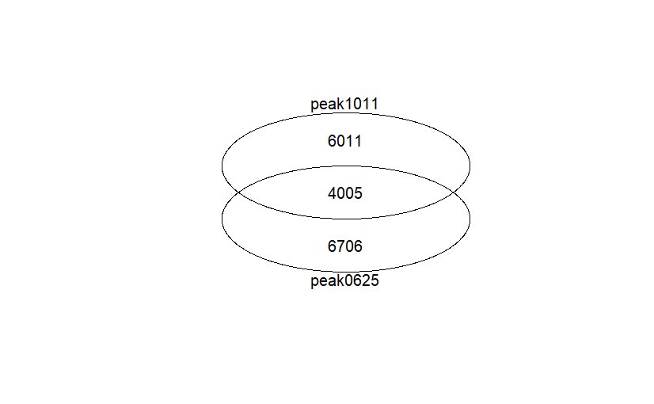

<br>

---
## ChIP-seq Overlap Statistical testing

Overlap is very important, if two ChIP experiment by **two different proteins** **overlap in a large fraction** of their peaks, **they may cooperative in regulation.**


### Shuffle genome coordination

- The `shuffle()` function to randomly permute the genomic locations of ChIP peaks defined in a genome which stored in `TxDb` object
  
- `shuffle()` **随机化 ChIP-seq 峰的基因组坐标**，但确保它们仍然位于 **基因组的有效区域**。这个方法常用于计算 **背景分布**，进而评估 ChIP-seq 峰的 **富集显著性**

```r
p <- GRanges(seqnames=c("chr1", "chr3"),
             ranges=IRanges(start=c(1, 100), end=c(50, 130)))

shuffle(p, TxDb=TxDb)
```

```text
GRanges object with 2 ranges and 0 metadata columns:
      seqnames              ranges strand
         <Rle>           <IRanges>  <Rle>
  [1]     chr1 241954092-241954141      *
  [2]     chr3 161021597-161021627      *
  -------
  seqinfo: 2 sequences from an unspecified genome; no seqlengths
```

<br>

### Peak overlap enrichment analysis

`enrichPeakOverlap()` 工作原理**

1. **计算真实重叠峰值数**
   
    - 计算 `queryPeak`和 `targetPeak`之间的实际重叠峰数量。
    <br>
2. **生成随机背景分布**
   
    - 使用 `shuffle()` 函数 **随机化** `queryPeak` 的基因组坐标，生成 **nShuffle 组** 随机峰数据。
    
    - 对每组随机峰集，与 `targetPeak` 计算重叠峰值数，从而构建 **背景分布（null distribution）**。
    <br>
3. **计算富集显著性**
   
    - 统计实际峰值重叠数 **是否远高于随机背景**，用 **p 值** 评估其显著性。
    
    - 采用 Benjamini-Hochberg（`BH`）方法进行 **多重假设检验校正**来校正 p 值。

<br>

```r
Overlap_analysis=enrichPeakOverlap(
  queryPeak=peak_list[[1]],       # bed file or GRanges object
  targetPeak=peak_list,  # target bed file(s) or folder or a list of GRanges objects
  TxDb= TxDb,           # TxDb objects
  pAdjustMethod="BH",   # pvalue adjustment method
  nShuffle=50,          # shuffle numbers
  chainFile=NULL,       # chain file for liftOver(基因轴坐标转换)
  pool=FALSE,           # whether Merge targetPeak (multiple ChIP seq peaks)
  mc.cores = detectCores()-1,  # number of cores
  verbose= FALSE)  # whether Print detailed information  
```

- **Error**: The input of `list of GRanges` for `targetPeak` here will result in **different target peak p-values being the same**. If we input `bed file (s) or folder` , this problem will not occur.
    <br>
- To speed up the compilation of this vignettes, we only set `nShuffle` to **50** as an example for only demonstration. User should set the number to **1000 or above** for more robust result
    <br>
- Parameter `chainFile` are chain file name for mapping the `targetPeak` to the genome version consistent with `queryPeak` when their genome version are different.
  
    - This creat the possibility of comparison among different genome version and cross species
      
    - The detailed `chainFile` you should see 🪨[[#Chain file]]  🔗[Chain file](#Chain-file)

<br>

```r
Overlap_analysis
```

```text
           qSample  tSample  qLen  tLen  N_OL     pvalue   p.adjust
peak0625 queryPeak peak0625 10714 10714 10714 0.01960784 0.01960784
peak1011 queryPeak peak1011 10714 10019  1833 0.01960784 0.01960784
```

- `qSample` is the name of `queryPeak`
  
- `qLen` is the the number of peaks in `queryPeak`
  
- `N_OL` is the number of overlap between `queryPeak` and `targetPeak`

<br>

---
## ChIP-seq Data Mining from GEO

### GEO data collection

There are many ChIP seq data sets that have been published and deposited in GEO database

* [ChIPseeker](http://bioconductor.org/packages/ChIPseeker)collect about **17,000** **bed files** deposited in GEO

- User can use `getGEOspecies()` to get a summary based on speices

	```r
	GEOspecies <-getGEOspecies()
	GEOspecies[c(1:10),]
	```
	
	```text
	                                               species Freq
	1                      Actinobacillus pleuropneumoniae    1
	2  Actinobacillus pleuropneumoniae serovar 3 str. JL03    1
	3                                        Aedes aegypti   11
	4                                             Anabaena    6
	5                                  Anolis carolinensis    7
	6                                    Anopheles gambiae    2
	7                                       Apis mellifera   17
	8                            Apis mellifera scutellata    1
	9                                          Arabidopsis   17
	10                                  Arabidopsis lyrata    4
	```


<br>

* User can use `getGEOgenomeVersion()` to get a summary based on genome version

	```r
	GEOgenomeVersion <- getGEOgenomeVersion()
	GEOgenomeVersion
	```
	
	```text
	                        organism genomeVersion  Freq
	1            Anolis carolinensis       anoCar2     7
	2                     Bos taurus       bosTau4     2
	3                     Bos taurus       bosTau6    33
	4                     Bos taurus       bosTau7     2
	5         Canis lupus familiaris       canFam3    10
	6         Caenorhabditis elegans          ce10   328
	7         Caenorhabditis elegans           ce6    64
	8                    Danio rerio       danRer6    89
	9                    Danio rerio       danRer7    89
	10       Drosophila melanogaster           dm3   767
	11                 Gallus gallus       galGal3    33
	12                 Gallus gallus       galGal4    73
	13        Gasterosteus aculeatus       gasAcu1     1
	14         Heterocephalus glaber       hetGla2     4
	15                  Homo sapiens          hg18  3368
	16                  Homo sapiens          hg19 30326
	17                  Homo sapiens          hg38  4091
	18                  Mus musculus          mm10 19089
	19                  Mus musculus           mm8   556
	20                  Mus musculus           mm9 17247
	21         Monodelphis domestica       monDom5    31
	22                    Ovis aries       oviAri3     2
	23               Pan troglodytes       panTro3    48
	24               Pan troglodytes       panTro4    48
	25                Macaca mulatta       rheMac2    84
	26                Macaca mulatta       rheMac3    40
	27             Rattus norvegicus           rn5    66
	28      Saccharomyces cerevisiae       sacCer2   145
	29      Saccharomyces cerevisiae       sacCer3  2646
	30                    Sus scrofa       susScr2    17
	31                    Sus scrofa       susScr3    18
	32           Taeniopygia guttata       taeGut2    20
	33 Xenopus (Silurana) tropicalis       xenTro3     3
	```

<br>

* User can access the detail information by `getGEOInfo()`, for each genome version.

	```r
	rn5 <- getGEOInfo(genome="rn5", simplify=TRUE)
	rn5[c(1:6),]
	```
	
	```text
	series_id          gsm         organism           title               supplementary_file                                                                                           genomeVersion pubmed_id
	GSE61204,GSE61207  GSM1499535  Rattus norvegicus  MEF2A_ChIP-exo 1   ftp://ftp.ncbi.nlm.nih.gov/geo/samples/GSM1499nnn/GSM1499535/suppl/GSM1499535_mef2_rn5_q37_nodups.nomodel.tolarge_peaks.bed.gz  rn5            <NA>
	GSE72725,GSE72727  GSM1869162  Rattus norvegicus  Chd7_d3            ftp://ftp.ncbi.nlm.nih.gov/geo/samples/GSM1869nnn/GSM1869162/suppl/GSM1869162_Chd7_d3_peaks.bed.gz                             rn5            <NA>
	GSE72725,GSE72727  GSM1869163  Rattus norvegicus  Sox10_d3           ftp://ftp.ncbi.nlm.nih.gov/geo/samples/GSM1869nnn/GSM1869163/suppl/GSM1869163_Sox10_d3_peaks.bed.gz                            rn5            <NA>
	GSE100505          GSM2685495  Rattus norvegicus  RAT_EDL_M3         ftp://ftp.ncbi.nlm.nih.gov/geo/samples/GSM2685nnn/GSM2685495/suppl/GSM2685495_junctions_all_RAT_EDL_M3.bed.gz                  rn5            <NA>
	GSE100505          GSM2685514  Rattus norvegicus  RAT_SOL_F4         ftp://ftp.ncbi.nlm.nih.gov/geo/samples/GSM2685nnn/GSM2685514/suppl/GSM2685514_junctions_all_RAT_SOL_F4.bed.gz                  rn5            <NA>
	GSE100505          GSM2685493  Rattus norvegicus  RAT_EDL_M1         ftp://ftp.ncbi.nlm.nih.gov/geo/samples/GSM2685nnn/GSM2685493/suppl/GSM2685493_junctions_all_RAT_EDL_M1.bed.gz                  rn5            <NA>
	```

<br>

### Download GEO ChIP data sets

[ChIPseeker](http://bioconductor.org/packages/ChIPseeker) provide function `downloadGEObedFiles()` to download **all the bed files of a particular genome**

```r
# creat rn5 folder
dir.create("rn5", showWarnings = FALSE, recursive = TRUE)  
```

```r
# downland geo bed file
downloadGEObedFiles(genome="rn5", # genome version
                    destDir="rn5"  # #downland location
                    )
```

<br>

这里作者提供的`downloadGEObedFiles()` 代码**有问题**，因为GEO 服务器可能已经不支持 FTP 访问，建议改用 HTTPS，所以我对代码进行了修改，创建了个新函数`downloadGEObedFilesHTTPS()`
```r
downloadGEObedFilesHTTPS <- function(genome,destDir) {
    # Obtaining genomic information
    info <- getGEOInfo(genome)
    
    # Get supplementary_file column
    fnames <- as.character(info$supplementary_file)
    
    # Replace FTP with HTTPS
    fnames_https <- gsub("^ftp://", "https://", fnames)
    
    # Generate target file path
    destfiles <- file.path(destDir, basename(fnames_https))
    names(destfiles) <- NULL
    
    # Traverse and download files
    for (i in seq_along(fnames_https)) {
        
      # 检查 destfiles[i]是否已存在，文件不存在，则执行下载
      if (!file.exists(destfiles[i])) {
            tryCatch(
                download.file(fnames_https[i], 
                              destfile = destfiles[i], 
                              mode = "wb"),#以二进制模式下载，确保文件不会因换行符问题损坏。
                error = function(e) message(fnames_https[i], ": file not found and skip")
            )
        }
    }
}
```

```r
downloadGEObedFilesHTTPS(genome="rn5", destDir="rn5")
```

<br>

### Overlap significant testing

- After download the bed files from GEO, we can pass them to for testing the significant of overlap
    <br>
- **Signifcant overlap** can be use to generate hypothesis of cooperative regulation
    <br>
- We can use `enrichPeakOverlap()` function to assess **Statistical testing** . detail see 🪨[[#ChIP-seq Overlap Statistical testing]]  🔗[ChIP-seq Overlap Statistical testing](#ChIP-seq-Overlap-Statistical-testing)
    <br>
- In different genome versions, parameter `chainFile` that can pass a `chain file` and `liftOver` the `targetPeak` to the genome version consistent with `queryPeak`